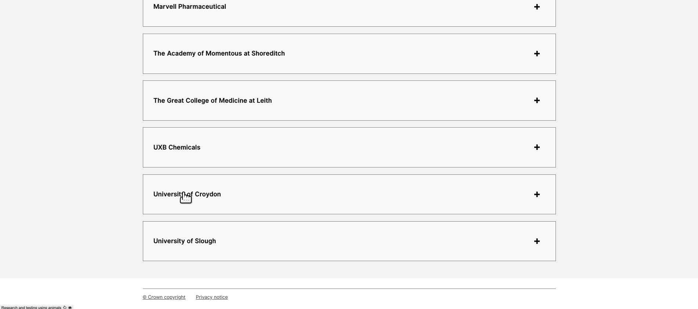
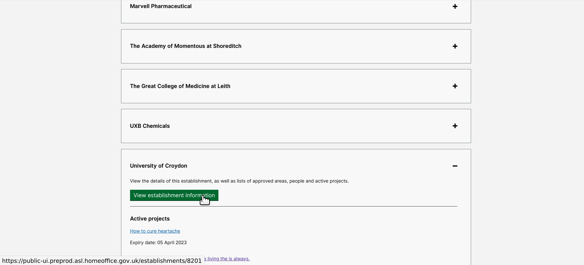
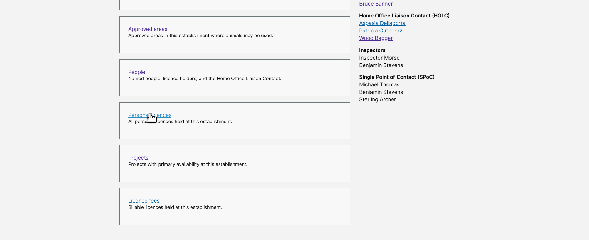
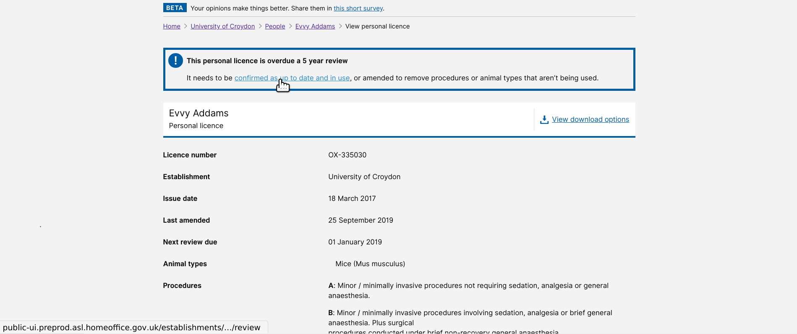

# Completing a 5yr PIL review without amending the licence 
Holc logs on  
Select Establishment  
View Establishment Details  
Click on Personal Licences   
Overdue Pils are listed, most overdue first (Deadline passed means the 5yr PIL review date is in the past)  
Soon to be overdue PILs are listed next  

Click on PIL number  
Review PIL Details  
Click on confirmation link  
Confirm Review  
Confirmation Sent  

NTCO logs on   
PIL review appears in NTCO's task list  
NTCO selects to endorse PIL review  
NTCO final comments and endorse  
PIL review is complete  

