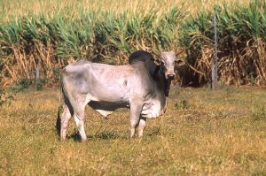

# Summary as of Wednesday 03th July 2024

## Future research and recruitment 

Thank you for your continued involvement in user research – your participation is integral to understanding the user experience on ASPeL. The research on the Named Persons journey continues.  
 

Please note that the link to the Roadmap is no longer available here.

Completed Sprint 145 (Zebu)

Fun facts about Zebu: Zebus are in the cattle family but much smaller, they are sacred in India, where they are used only as draft animals, and for producing milk. 

# Completed this Sprint: 145 (Zebu)
1) We added the HBA upload functionality to the PPL transfer journeys
2) We corrected the reported issue that the comment indicator was not showing when using reusable steps
3) We presented a Show and Tell on Digital product lifecycle to improve the understanding of ASPeL team's work processes
4) We continued designing the journey for other named person roles in ASPeL based on the user research results
5) In Design, we added the inspector task screens for named person applications based on user research results
6) We designed and added the NVS and NACWO training modules that are currently missing to the design in ASPeL based on user research
7) We presented the Standard Protocols user research findings and next steps back to ASRU
8) We Updated the deployment pipeline to re-run failed tests more efficiently, thereby, improving test performance in ASPeL.

# Bugs Fixed this Sprint
1) Based on reports by users that the comment indicator was not showing on reusable steps we applied a fix.
2) We applied a fix to users' reports that they were unable to download DOCX version of project licence amendments.
3) We applied a fix to the problems with downloading the NTS of draft project licences, which was reported by users to be failing.

# New Sprint: 146(aye-aye)

Attribution:

Fun facts about aye-aye: 

 

## Planned for Sprint 146 (aye-aye)
1) We are starting Development work to implement a better user experience for those choosing to keep animals alive	on ASPeL	
2) Our user researcher is aiming to recruit external users for usability research on the Named People journey
3) We will continue to onboard additional joiners as they land
4) We are starting work to further reduce the Tech Debt on ASPeL, this will serve to mitigate security risks on ASPeL
5) We will be planning the work that will ensure ASPeL is compliant with accessibility standards
6) Developers will review and apply fixes to issues reported on reusable steps which meant that the highlighting were inconsistent with expectations 
7) We will define content and behaviour requirements for one Standard protocol ahead of design work on project licence improvements

   

## Things to bear in mind
Kindly let us know how we are doing in keeping you informed. We appreciate your feedback on the content of this report.

# Work in progress
1) Improvements to the user experience when making the choice of Keeping animals alive on ASPeL
  

   
 
   
## Support tickets and known issues
[Link to Support Board](https://collaboration.homeoffice.gov.uk/jira/secure/RapidBoard.jspa?rapidView=1717)
