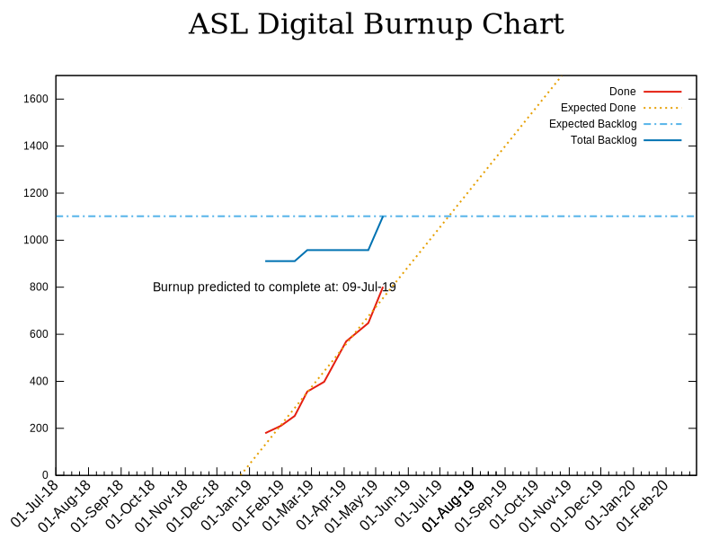

# Project Burnup Chart

## Note about the burnup chart
The burnup chart is showing that we are on course to deliver functionality for when it is required. However, it should be noted that the overall amount of work we aware of that is require for release increased. Further work maybe discovered as we get closer to release.

We also expect to spend any time between completion of funtionality and the end of August deadline testing and fixing any issues that are identified with the new system.
