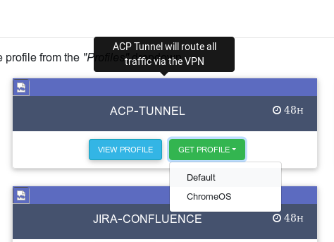

# ASL Environments

## Live

### Internal site - requires a tunnel VPN
[https://internal.aspel.homeoffice.gov.uk/](https://internal.aspel.homeoffice.gov.uk/)

### Public
[https://external.aspel.homeoffice.gov.uk/](https://external.aspel.homeoffice.gov.uk/)

## Pre Prod
### Public
[Public PreProd https://public-ui.preprod.asl.homeoffice.gov.uk/?widescreen=true](https://public-ui.preprod.asl.homeoffice.gov.uk/?widescreen=true)

### Internal
[Internal PreProd https://internal-ui.preprod.asl.homeoffice.gov.uk/?widescreen=true](https://internal-ui.preprod.asl.homeoffice.gov.uk/?widescreen=true)

## Dev

### Public
[Public Dev https://public-ui.dev.asl.homeoffice.gov.uk/?widescreen=true](https://public-ui.dev.asl.homeoffice.gov.uk/?widescreen=true)

### Internal
[Internal Dev https://internal-ui.dev.asl.homeoffice.gov.uk/?widescreen=true](https://internal-ui.dev.asl.homeoffice.gov.uk/?widescreen=true)

## DT (Drafting Tool)

### Prod - ish
[https://ppl-prototype.herokuapp.com/](https://ppl-prototype.herokuapp.com/)

### Dev
[https://ppl-staging.herokuapp.com](https://ppl-prototype.herokuapp.com/)

### How to I run a vpn?

You need to do this *every day or so*.

1. Go to [https://access-acp.digital.homeoffice.gov.uk/ui/profiles](https://access-acp.digital.homeoffice.gov.uk/ui/profiles)

2. Download the ACP-TUNNEL default ovpn file

3. Run the relevant command for openvpn on your os

*for my OS - Ubuntu - it's:*

`sudo openvpn vpn-acp-tunnel-NNNNNNN-NNNNN.ovpn`

*Note: This might not work when we're in the Home Office estate, e.g. in Croydon, because of reasons, so the only way to access internal pages when at the HO might be via VPN and tethering on your phone.*

