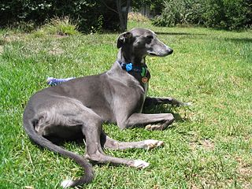

# Summary as of Wednesday 01 February 2023

## New Features!
We've just released some new features to make ASPeL quicker and easier to use!

1. You can now add or edit a condition within an Establishment License amendment task rather than navigating to the License to make the changes.
2. We've included a link to Project License application guidance on the application form

Don't forget to check out our [roadmap](https://roadmap.prodpad.com/937455be-8d08-11ed-aa53-2a7db0eb1d9c) to see what's coming next to ASPeL.

## Completed in Sprint 125 (Flamingo)
* Completed designs for Corporate entities, ready to develop
* Security improvements
* Additional requirements for managing Conditions incorporated into development

## Bugs Fixed this Sprint
The following bugs were fixed in this sprint.
[Bug Fixes week to Wednesday 01st February 2023](graphs/bugs01022023.png)

# New Sprint: 126 (Greyhound)

## Planned for Sprint 126 (Greyhound)
1. Improve the experience of adding/amending conditions on licenses for License Holders and Licensing Officers
2. Finish Corporate features (excluding migration) 
3. Decide on the approach for the new Assessments feature

## Things to bear in mind
We welcome our new User Researcher to the team this week!

The Greyhound is a gentle and intelligent breed whose combination of long, powerful legs, deep chest, flexible spine, and slim build allows it to run at speeds exceeding 64 kilometres per hour (40 mph)!

## Work in progress
* Research into the Assessment documentation process
* Improvements to Category E (training) license process
* Develop Corporate entity changes
* Finish development of Manage Conditions feature

We planned the following issues in this sprint 
[Sprint 126](graphs/sprint01032023.png)

## Support tickets and known issues
[Link to Support Board](https://collaboration.homeoffice.gov.uk/jira/secure/RapidBoard.jspa?rapidView=1717)

## Roadmap

[Link to our new Roadmap](https://roadmap.prodpad.com/937455be-8d08-11ed-aa53-2a7db0eb1d9c)
