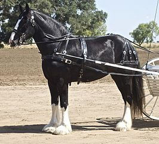

# Summary as of Wednesday 01 February 2023

## New Features!
New feature updates are coming soon for;

1. Corporate Establishments
2. Project License Conditions

Don't forget to check out our [roadmap](https://roadmap.prodpad.com/937455be-8d08-11ed-aa53-2a7db0eb1d9c) to see what's coming next to ASPeL.

## Completed in Sprint 126 (Greyhound)
* Content updates for add/amend conditions feature
* Development complete for Corporate Establishments
* Design complete for updates to Category E license management

## Bugs Fixed this Sprint
The following bugs were fixed in this sprint.
[Bug Fixes week to Wednesday 01st March 2023](graphs/bugs01032023.png)

# New Sprint: 127 (Shire Horse)

## Planned for Sprint 126 (Greyhound)
1. Corporate Establishments go live
2. Complete Category E license content design
3. Investigate improvements to species lists and Establishment License abbreviations

## Things to bear in mind
We are researching! Over the next 4 weeks we will be inviting ASRU staff and the ASPeL community to take part in research sessions to learn more about how you use ASPeL. Speak to your Home Office Liaison Contact or the ASPeL Product Managers to learn more.

The Shire is known for its easy-going temperament and has an incredible capacity for pulling weight!

## Work in progress

We planned the following issues in this sprint 
[Sprint 126](graphs/sprint01032023.png)

## Support tickets and known issues
[Link to Support Board](https://collaboration.homeoffice.gov.uk/jira/secure/RapidBoard.jspa?rapidView=1717)

## Roadmap

[Link to our new Roadmap](https://roadmap.prodpad.com/937455be-8d08-11ed-aa53-2a7db0eb1d9c)
