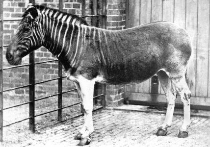

# Summary as of Wednesday 01 June 2022 

# Sprint 110 (Quagga) 

## Just Done
* TEXT_HERE
* TEXT_HERE
* TEXT_HERE

## About to Do/Doing
* TEXT_HERE
* TEXT_HERE
* TEXT_HERE

## Bugs Fixed this week
The following bugs were fixed this week.
[Bug Fixes week to Wednesday 01 June 2022](graphs/bugs01062022.png)

We planned the following issues in this sprint 
[Sprint 110](graphs/sprint01062022.png)

## Support tickets and known issues
[Link to Support Board](https://collaboration.homeoffice.gov.uk/jira/secure/RapidBoard.jspa?rapidView=1717&selectedIssue=ASSB-253)

[Support board - cached](graphs/supportBoard01062022.png)

## Click here for metrics / progress against plan
[Sprint 110](graphs/progress01062022.png)

[Post Release Roadmap](graphs/roadmap01062022.png)

1. Establish plan and progress time-based conditions

## Google Analytics for this report
[Google Analytics](graphs/GA01062022.png)

