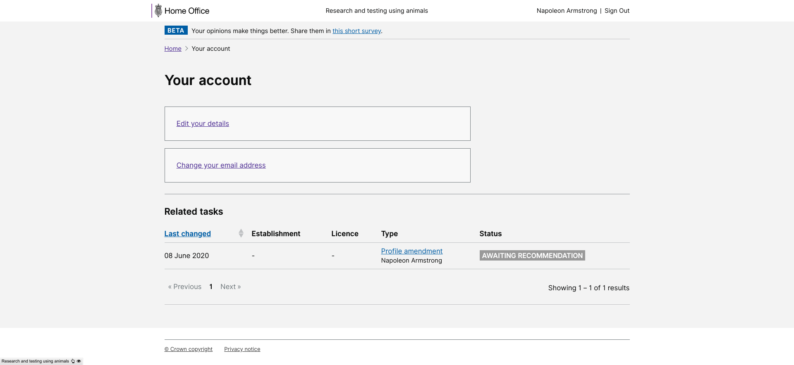

# Summary as of Wednesday 01 July 2020 

# Sprint 61

## Just Done
* Fixed the paging / filtering of internal search results - working software
* Discussion guide for testing with inspectors a prototype with new features - user research
* Content for new features currently being tested with inspectors
* Held research sessions with two inspectors
* Improvements to statutory deadlines and activity history - design
* Changed metadata and declarations on PPL submission - working software
* Full PPL application PDF download - working software
* Completed 5 year PIL review report - working software
* Fix PPL keywords in NTS documents - working software
* Tasks actioned by users now appear in the related tasks section on the user's (global) profile page - working software

## About to Do/Doing
* Research sessions with two more inspectors
* Improvements around commenting on PPLs - design
* Refinements to content following inspector feedback
* Improve search infrastructure to return better search results - working software
* Provide separate task processed metrics for legacy and new style PPLs - working software
* Alert NTCOs and admin users to outstanding PIL reviews at their establishment(s) - working software
* Allow users to disassociate themselves from establishments where they hold no licences or roles - working software

## Bugs Fixed this week
The following bugs were fixed this week.
[Bug Fixes week to Wednesday 01 July 2020](graphs/bugs01072020.png)

We planned the following issues in this sprint 
[Sprint 61](graphs/sprint01072020.png)

## Support tickets and known issues
[Link to Support Board](https://collaboration.homeoffice.gov.uk/jira/secure/RapidBoard.jspa?rapidView=1717&selectedIssue=ASSB-253)

[Support board - cached](graphs/supportBoard01072020.png)

## Click here for metrics / progress against plan
[Sprint 61](graphs/progress01072020.png)

[Post Release Roadmap](graphs/roadmap01072020.png)

## These are the goals for the current sprint:

1. Content design for statutory deadlines 
2. Explore search - fuzzy matching 
3. Design improve commenting on applications 
4. Conduct user research with inspectors on statutory deadlines

## Sample Design Prototypes
### Tasks actioned by users now appear in the related tasks section on the user's (global) profile page

 
### Completed 5 year PIL review report - working software

 

## Google Analytics for this report
[Google Analytics](graphs/GA01072020.png)

