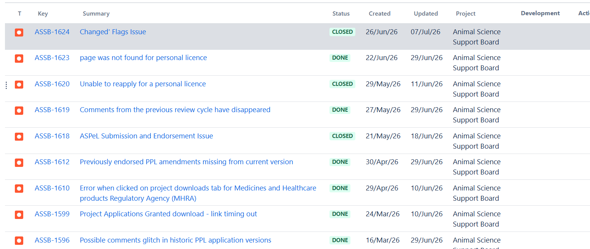
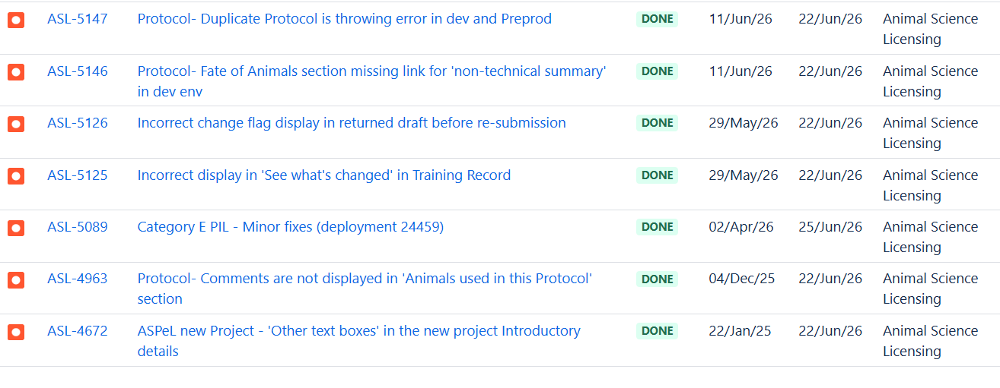
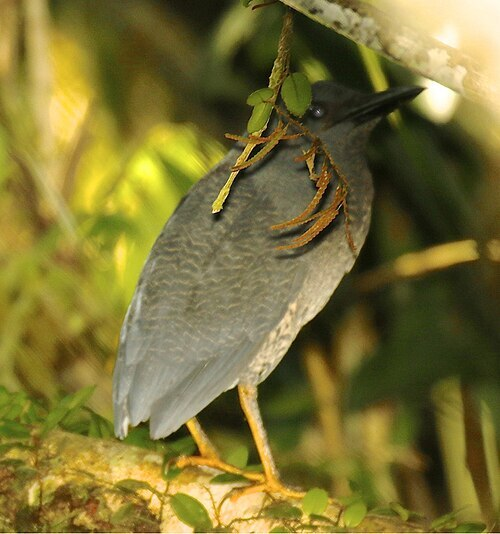

# Summary as of Wednesday 1st July 2026

## Future research and recruitment 

Thank you for your continued involvement in user research for ASPeL– your participation is integral to understanding the user experience. The research on ASPeL features continues. Please contact ASPELTechnicalQueries@homeoffice.gov.uk to participate. Thank you.  
 
# Completed Sprint 170(Yak)

Attribution:

Interesting facts about Yaks, they communicate through grunts, hence their nick name 'grunting Ox'. They can walk within 10 minutes of birth.

# Completed this Sprint: 170(Yak)

1) We fixed comments appearing outside of expected timeline
2) Completed and demonstrated standard protocol test cases for editable and non-editable protocols ahead of the planned proof of concept.
3) We completed an investigation into building bulk downloads of Non Technical Summaries.
4) We completed another spike into options for preventing time out on critical downloads on ASPeL
5) We fixed a bug causing incorrect display of 'see what's changed' in training record
6) We fixed the incorrect change flag display in returned draft before re-submission

# Bugs done or closed this Sprint

# New Sprint 171(Zigzag heron)

Attribution:

Interesting facts about zigzag herons: these birds have a peculiar habit of tail flicking when hunting.

# Our goals for Sprint 171(zigzag Heron)
Development:
1)Complete standard protocol Proof of Concept for Standard Protocol4
2)Create NTS bulk.docx download 
3)Complete all remaining Named Person work to achieve 100% completion
4)Make required improvements to actions-tasks-metrics in ASPeL to support the business performance management work.
5)Create functionality to measure any improvements in standard protocols work post deployment of the Minimum viable product.

   
  
  

   
  
  

## Things to bear in mind
Kindly let us know how we are doing in keeping you informed. We appreciate your feedback on the content of this report. Thank you.

