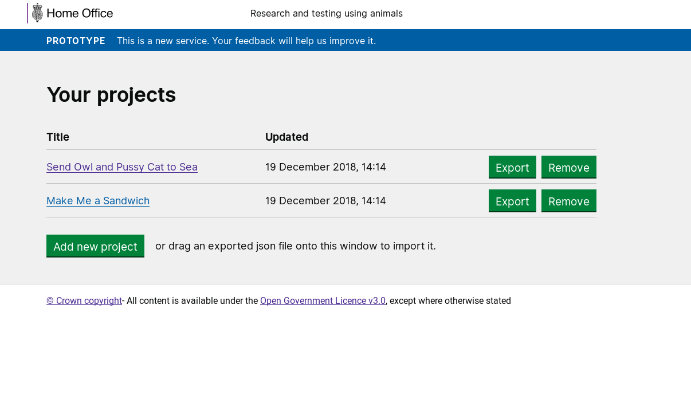
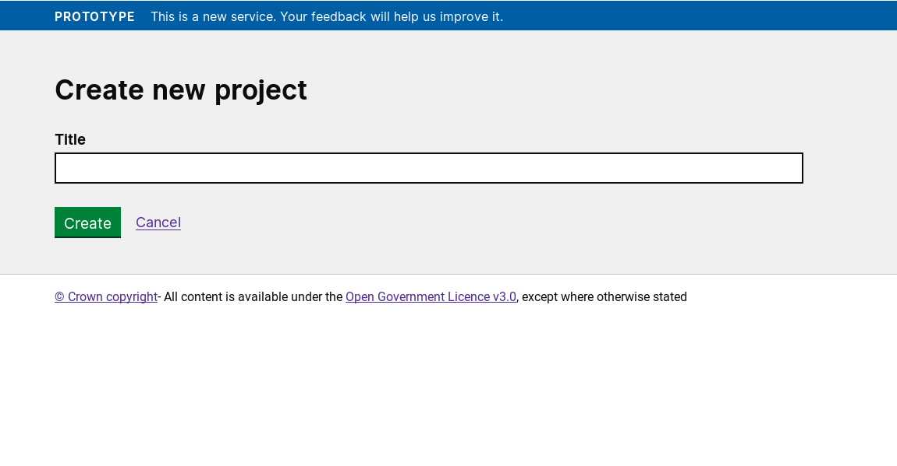

# Summary as of 2nd January 2019 

## About to Do/Doing
* Organising protocols research for January 24th/25th 
* Iterating design of protocol input for PPL application
* Develop working software for advanced user input in the PPL application prototype

## Click here for Prioritised Road Map
[Prioritised Road Map](https://trello.com/b/p7x9hbPV/prioritised-roadmap)    [\(Cached Image\)](graphs/ASLRoadMap02012019.jpg)

## Click here for metrics / progress against plan
[Week 3 - Sprint 23 - Release 1](graphs/progress02012019.png)

## Burnup Chart

[Burnup Chart](burnup02012019.md)

## Risks
[Links to Project Risks in Trello](https://trello.com/b/VuFuCL7t/risk-register-and-kpis-asl-delivery)    [\(Cached Image\)](graphs/ASLRiskRegister02012019.jpg)

[Risk Management Chart](graphs/risk02012019.png)

## Sprint Planning
* We planned the following issues in sprint planning [Link to Issues in Jira](https://jira.digital.homeoffice.gov.uk/secure/RapidBoard.jspa?rapidView=261)    [\(Cached Image\)](graphs/sprint02012019.png)

**Our goals for the sprint are:**
1. Advanced user input in PPL prototype
2. User feedback on new sections of PPL form
3. Iterate protocols for PPL
4. Explore PPL Application types/routing

## "University of Croydon" Test Environment 

### Screenshots

 
 

## Google Analytics for this report

This shows:
* total number of users
* number of new users

[Google Analytics](graphs/GA02012019.jpg)

