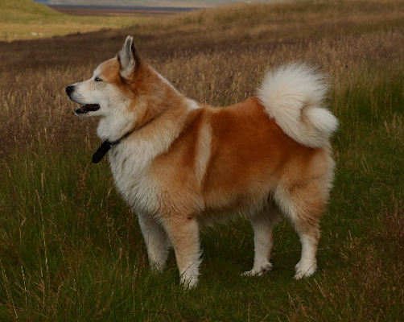
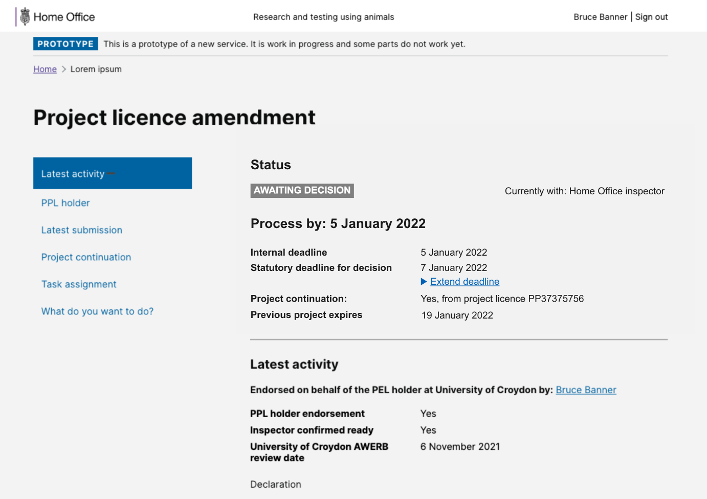

# Summary as of Wednesday 02 February 2022 

# Sprint 102 (Icelandic Sheepdog)

## Just Done
* TEXT_HERE
* TEXT_HERE
* TEXT_HERE

## About to Do/Doing
* TEXT_HERE
* TEXT_HERE
* TEXT_HERE

## Bugs Fixed this week
The following bugs were fixed this week.
[Bug Fixes week to Wednesday 02 February 2022](graphs/bugs02022022.png)

We planned the following issues in this sprint 
[Sprint 102](graphs/sprint02022022.png)

## Support tickets and known issues
[Link to Support Board](https://collaboration.homeoffice.gov.uk/jira/secure/RapidBoard.jspa?rapidView=1717&selectedIssue=ASSB-253)

[Support board - cached](graphs/supportBoard02022022.png)

## Click here for metrics / progress against plan
[Sprint 102](graphs/progress02022022.png)

[Post Release Roadmap](graphs/roadmap02022022.png)

### We set these goals for the current sprint
1. Get enforcement flags ready for development (user research and design) ***[Done]***
2. Reporting and metrics pages - release candidate (development) ***[Done]***

### These were the goals for the previous sprint
1. Plan testing of enforcement flags - round 2 (User research) ***[Done]***
2. Displaying deadlines on tasks (working software) ***[In progress]***
3. Preparing enforcement flags for testing - round 2 (design) ***[Done]***

## Sample Design Prototypes

 

 

## Google Analytics for this report
[Google Analytics](graphs/GA02022022.png)

