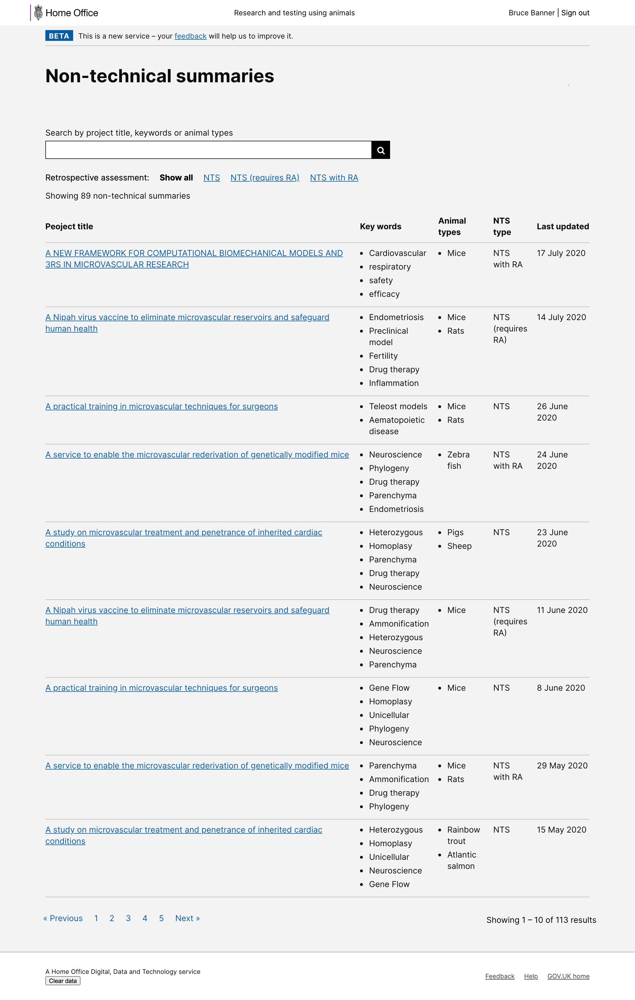

# Summary as of Wednesday 02 September 2020 

# Sprint 66

## Just Done
* Series of fixes to improve site accessibility - working software 
* Improvements to the task activity log - working software
* Reviewing use of comments on tasks - content design
* NTS directory and publishing flow - design

## About to Do/Doing
* Category E PILs - working software
* Improvements to PPL deadline handling - working software
* Reviewing use of declarations - content design
* Reviewing previous PPL assessments work - design

## Things to bear in mind
* We have completed the first merger of two establishments within the system
* We made a presentation to HOLCs at the HOLTIF meeting regarding progress with ASPeL

## Bugs Fixed this week

The following bugs were fixed this week.
[Bug Fixes week to Wednesday 02 September 2020](graphs/bugs02092020.png)

We planned the following issues in this sprint 
[Sprint 66](graphs/sprint02092020.png)

## Support tickets and known issues
[Link to Support Board](https://collaboration.homeoffice.gov.uk/jira/secure/RapidBoard.jspa?rapidView=1717&selectedIssue=ASSB-253)

[Support board - cached](graphs/supportBoard02092020.png)

## Click here for metrics / progress against plan
[Sprint 66](graphs/progress02092020.png)

[Post Release Roadmap](graphs/roadmap02092020.png)

## These are the goals for the current sprint:

1. Statutory deadline handling - working software 
2. Reviewing PPL assessments - design 
3. Review use of declarations - content design

## These were the goals for the previous sprint:

1. Design - Publishing process for NTSs and RAs ***[Done]*** 
2. Dev - Apply for Cat E PILs ***[Done]***
3. General - Accessibility improvements ***[Done]***

## Sample Design Prototypes
### NTS directory

 

## Google Analytics for this report
[Google Analytics](graphs/GA02092020.png)

