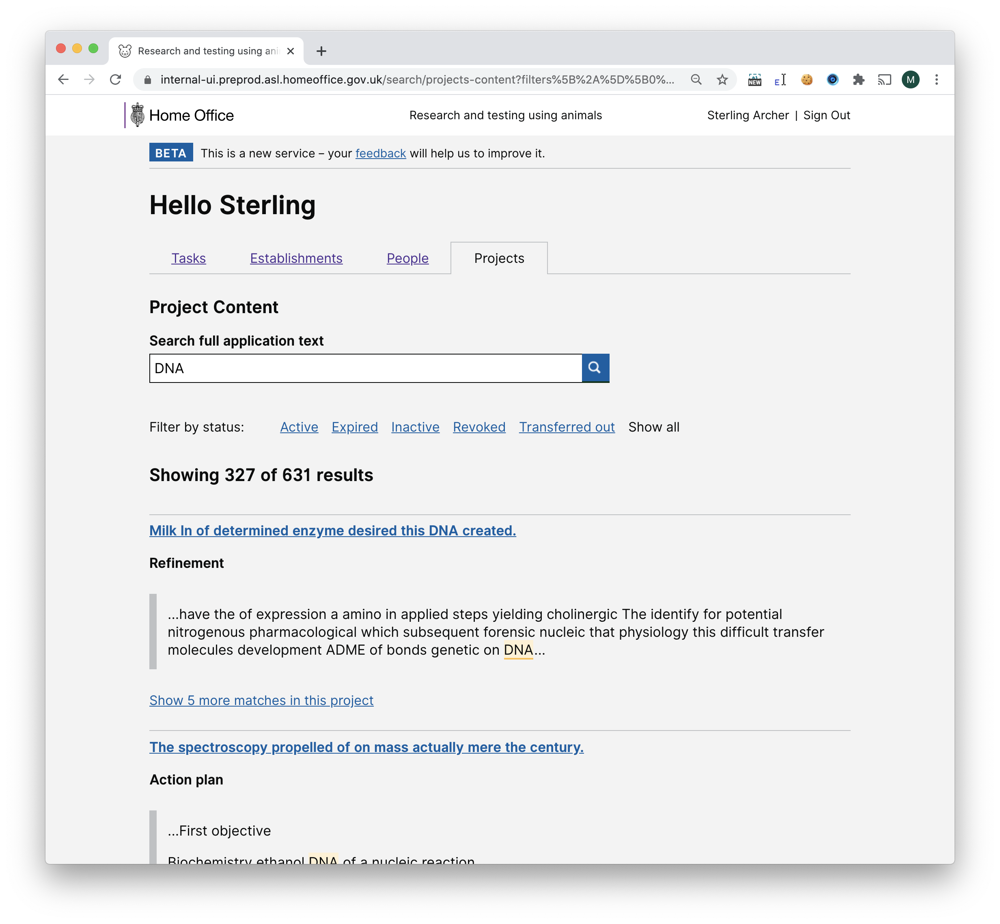

# Summary as of Wednesday 02 December 2020 

# Sprint 72.5 &#x1F418;

## Things to be aware of
* We reported to the governance board for the first time since the project was renewed.

## Just Done
* TEXT_HERE
* TEXT_HERE
* TEXT_HERE

## About to Do/Doing
* TEXT_HERE
* TEXT_HERE
* TEXT_HERE

## Bugs Fixed this week
The following bugs were fixed this week.
[Bug Fixes week to Wednesday 02 December 2020](graphs/bugs02122020.png)

We planned the following issues in this sprint 
[Sprint 72.5](graphs/sprint02122020.png)

## Support tickets and known issues
[Link to Support Board](https://collaboration.homeoffice.gov.uk/jira/secure/RapidBoard.jspa?rapidView=1717&selectedIssue=ASSB-253)

[Support board - cached](graphs/supportBoard02122020.png)

## Click here for metrics / progress against plan
[Sprint 72.5](graphs/progress02122020.png)

[Post Release Roadmap](graphs/roadmap02122020.png)

## Our goals for the current sprint (Elephant] &#x1F418;
1. Full content search on PPLs - working software 
2. Prepare and plan second iteration of ROPs testing (user research and design) 

## Screenshots of software in testing
### Early version of full text PPL search for ASRU

 

## Google Analytics for this report
[Google Analytics](graphs/GA02122020.png)

