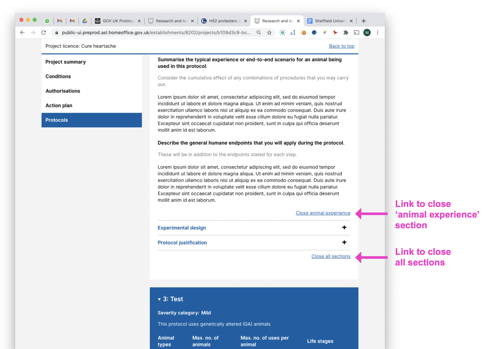

# Summary as of Wednesday 03 February 2021 

# Sprint 77 (Jaguar)

 
## Just Done
* Completed testing of the RoPs application with external users - user research
* Finalising external RoPs survey ready to share with users - content design
* Closing protocol sections from the bottom of protocols - design
* Adding an indicator for inactive establishments on external users global profiles - design
* Release RA submissions - working software
* Improved guidance when attempting to remove permissions from a user with licences or roles - working software
* Pre-release of email preferences UI for external users (this means the interface is hidden from most users but can be tested end-to-end before releasing fully) - working software
* Fixes to issues with PPL reporting - working software

## About to Do/Doing
* Analysing findings from the research - user research
* Creating internal RoPs survey for ASRU and HO staff - content design
* Preparing design specifications of RoPs for development - design 
* Initial technical architecture for RoP submission - working software
* Addition of filtered task lists for completed task reporting - working software
* Adding ability to associate a CJSM email address with an establishment - working software

## Bugs Fixed this week
The following bugs were fixed this week.
[Bug Fixes week to Wednesday 03 February 2021](graphs/bugs03022021.png)

We planned the following issues in this sprint 
[Sprint 77](graphs/sprint03022021.png)

## Support tickets and known issues
[Link to Support Board](https://collaboration.homeoffice.gov.uk/jira/secure/RapidBoard.jspa?rapidView=1717&selectedIssue=ASSB-253)

[Support board - cached](graphs/supportBoard03022021.png)

[Roadmap Visualisaton (Experimental) ](roadmapVisualisation03022021.md)

## Click here for metrics / progress against plan
[Sprint 77](graphs/progress03022021.png)

[Post Release Roadmap](graphs/roadmap03022021.png)
## We planned the following goals for sprint 77 (Jaguar)
1. Summarize the findings from RoPs testing with external users - agree improvements 
2. Performance metrics filtered task lists - working software 
3. Delivery plan for RoPs

## These were the goals for sprint 76 (Iguana)
1. Ship retrospective assessment - working software ***[Done]***
2. Test Returns of Procedures with users - round 2 - user research and design ***[Done]***

## Sample Design Prototypes
### Designs for closing protocol sections from the bottom of protocols

 

## Google Analytics for this report
[Google Analytics](graphs/GA03022021.png)

