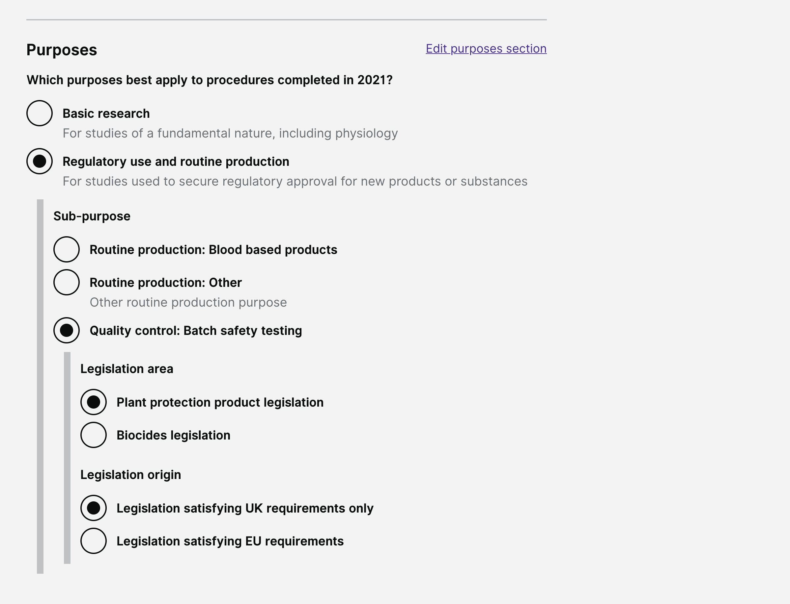

# Summary as of Wednesday 03 March 2021 

# Sprint 79 (Liger)

 

## Things to bear in mind
* There will be substantially reduced contribution from user research and design team members for at least 8 weeks while they work on another project

## Just Done
* High level journey map for Refuse a PPL - design
* Fixed issue with some content copied from Word documents causing incorrect change highlighting in PPL amendments - working software
* Improved selection of versions for comparison in case where establishment admin has returned PPL submissions to applicant - working software
* Fixed issue with PPL holder not showing correctly on old documents when a PPL holder has been changed - working software

## About to Do/Doing
* Supporting the developers building RoPs - design
* Continued development work on returns of procedures - working software

## Bugs Fixed this week
The following bugs were fixed this week.
[Bug Fixes week to Wednesday 03 March 2021](graphs/bugs03032021.png)

We planned the following issues in this sprint 
[Sprint 79](graphs/sprint03032021.png)

## Support tickets and known issues
[Link to Support Board](https://collaboration.homeoffice.gov.uk/jira/secure/RapidBoard.jspa?rapidView=1717&selectedIssue=ASSB-253)

[Support board - cached](graphs/supportBoard03032021.png)

## Click here for metrics / progress against plan
[Sprint 79](graphs/progress03032021.png)

[Post Release Roadmap](graphs/roadmap03032021.png)

## This is the goal for the current sprint (Liger)
1. RoPs submission release candidate - working software

## These were the goals for the previous sprint (Komodo dragon)
1. ROP - create a return of procedures - working software  ***[In progress]***
2. Understand user needs for ppl rejection - user research ***[In progress]***

## Screenshots of working software demonstrated at the show and tell
### Submit a return of procedures

 

## Google Analytics for this report
[Google Analytics](graphs/GA03032021.png)

