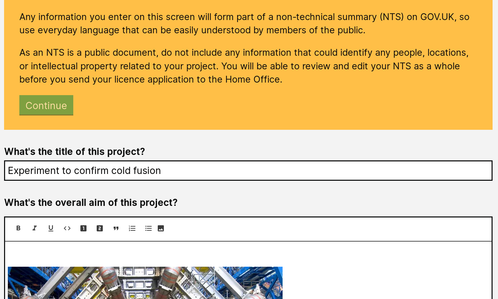
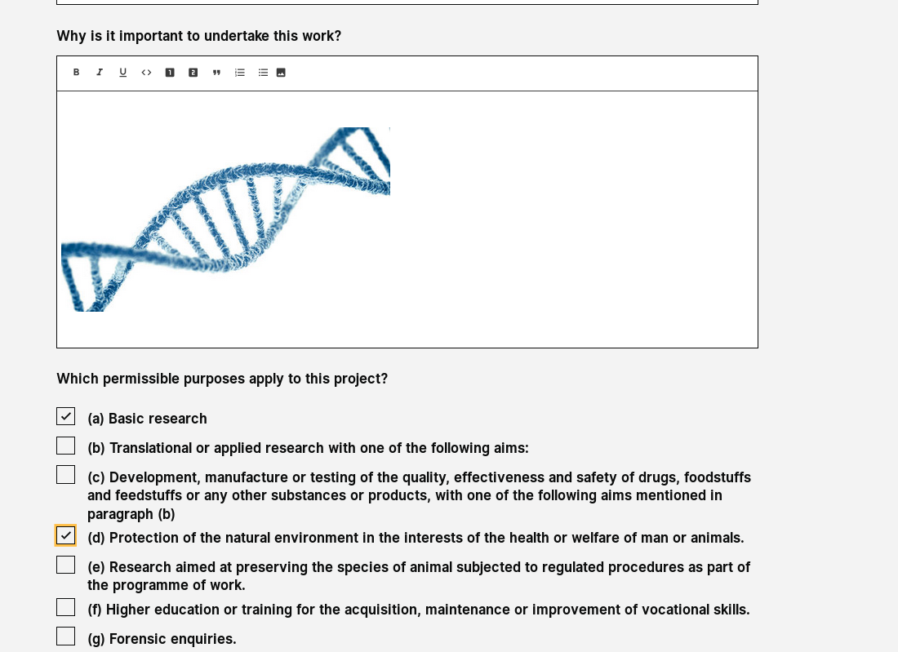

# Summary as of 3rd April 2019 

# Sprint 30

## Just Done
* User research of view of granted licences
* Demonstrated read view of legacy PPLs at ASRU conference
* First phase design of feedback and commenting components

## About to Do/Doing
* Working software "My tasks" list for ASRU user
* Design Pdf export of legacy PPLs
* Working software pdf export of PPLs
* HOLTIF meeting demo prep

## Things to be aware of
* The team presented at the ASRU conference last week
* They will present at the HOLTIF meeting next week 

## Click here for Prioritised Road Map
[Prioritised Road Map](https://trello.com/b/p7x9hbPV/prioritised-roadmap)    [\(Cached Image\)](graphs/ASLRoadMap03042019.jpg)

## Click here for metrics / progress against plan
[Week 1 - Sprint 30 - Release 1](graphs/progress03042019.png)

## Burnup Chart

[Burnup Chart](burnup03042019.md)

## Risks
[Links to Project Risks in Trello](https://trello.com/b/VuFuCL7t/risk-register-and-kpis-asl-delivery) 
[Link to Risk Chart](graphs/risk03042019.png)

## Sprint Planning
* We planned the following issues in sprint planning today [Link to Issues in Jira](https://jira.digital.homeoffice.gov.uk/secure/RapidBoard.jspa?rapidView=261)    [\(Cached Image\)](graphs/sprint03042019.png)

Our goals for the previous sprint were:
1. Read view of legacy PPLs
**[Yes]**
2. ASRU Establishment Assignment
**[In progress]**
3. Explore view of PPL licence data with establishments
**[Yes]*
4. Complete designs for granting PPLs
**[In progress]**

Our goals for the sprint are:
1. Design view of licences - PPLs  
2. User research - requirements for other kinds of PPL 
3. "My tasks" list - working software 
4. pdf export of PPLs

## Screenshots of the PPL Drafting tool 

 

 

## Google Analytics for this report

This shows:
* total number of users
* number of new users

[Google Analytics](graphs/GA03042019.jpg)

