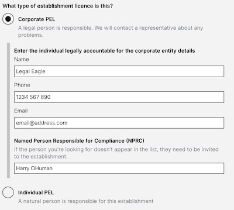

# Summary as of Wednesday 3rd May 2023

## New Features

**Category E Licenses**

We are now testing prototypes for the new PIL E experience. We're interested in speaking with Establishment License Holders and Administrators who deal with Category E Training & Higher Education licenses. Please get in touch if you're interested in taking part.

**Corporate Establishments** is now Live! 

Every Establishment License will now either be categorised as 'Corporate PEL' or 'Individual PEL'.

Corporate PELs have a Named Person Responsible for Compliance but will also now be required to provide contact details for an individual legally responsible for the company or organisation (such as a company secretary).

Individual PEL Establishment Licenses have a PEL Holder, who is the legally responsible person.

Don't forget to check out our [roadmap](https://roadmap.prodpad.com/937455be-8d08-11ed-aa53-2a7db0eb1d9c) to see what's coming next to ASPeL.

# Completed Sprint: 129 (Jackal)

## Completed in Sprint 129 (Jackal)
* Complted Category E License Prototypes
* Started testing new Category E license journey prototypes
* Refactoring and standardising some development and release processes
* Welcomed our new Content Designer to the team

## Bugs Fixed this Sprint
The following bugs were fixed in this sprint.
[Bug Fixes week to Wednesday 03rd May 2023](graphs/bugs03052023.png)

# New Sprint: 130 (Koala)

## Planned for Sprint 130 (Koala)
1. Complete usability testing for new Category E license experience
2. Complete design for new Named Person journey
3. Get improvements to Project License conditions process ready to go live
4. Deliver an ASPeL update to the PEL Holder Forum

## Things to bear in mind
We are still researching! We're interested in speaking with Establishment License Holders and Administrators who deal with Category E Training & Higher Education licenses.

The koala has one of the smallest brains in proportion to body weight of any mammal.

## Work in progress

## Support tickets and known issues
[Link to Support Board](https://collaboration.homeoffice.gov.uk/jira/secure/RapidBoard.jspa?rapidView=1717)

## Roadmap

[Link to our new Roadmap](https://roadmap.prodpad.com/937455be-8d08-11ed-aa53-2a7db0eb1d9c)
