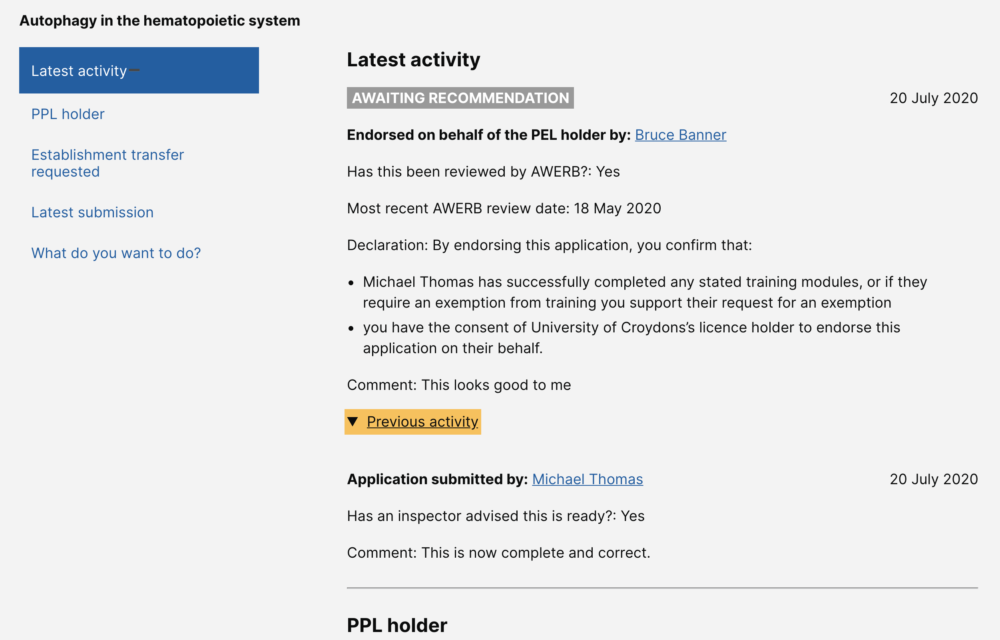

# Summary as of Wednesday 03 June 2020 

# Sprint 59

## Just Done
* Fixed diff views on completed tasks - working software
* Initial designs for handling PPL applications that have passed their statutory deadlines
* Improvements to task activity history - design
* Cat E PIL journey for existing PIL-Holders - content design
* Test training profiles with establishment users, licensing officers and inspectors

## About to Do/Doing
* Show tasks related to licences and profiles - working software
* Record of historic licence holders and named people - design
* Standardising success message content so there are fewer variations to manage - content design
* Cat E PIL journey for existing PIL-Holders - content design
* Make it clearer how users remove animal/POLE/additional establishment/objectives from PPL protocols - working software
* Summarise findings from training profiles user research

## Bugs Fixed this week
The following bugs were fixed this week.
[Bug Fixes week to Wednesday 03 June 2020](graphs/bugs03062020.png)

We planned the following issues in this sprint 
[Sprint 59](graphs/sprint03062020.png)

## Support tickets and known issues
[Link to Support Board](https://collaboration.homeoffice.gov.uk/jira/secure/RapidBoard.jspa?rapidView=1717&selectedIssue=ASSB-253)

[Support board - cached](graphs/supportBoard03062020.png)

## Click here for metrics / progress against plan
[Sprint 59](graphs/progress03062020.png)

[Post Release Roadmap](graphs/roadmap03062020.png)

Our goals for the current sprint are:
1. Working software - show tasks related to a licence 
2. Design - manage statutory PPL deadlines 
3. Content - review success messages 
4. User Research Cat-E with existing PIL holders

## Sample Design Prototypes
### Improvements to task activity history

 

## Google Analytics for this report
[Google Analytics](graphs/GA03062020.png)

## Completing a 5yr PIL review without amending the licence
[Five year PIL review](FiveYearPILReview.md)
