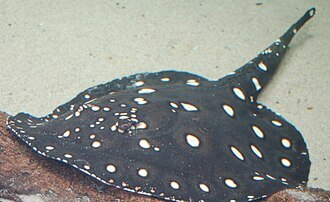
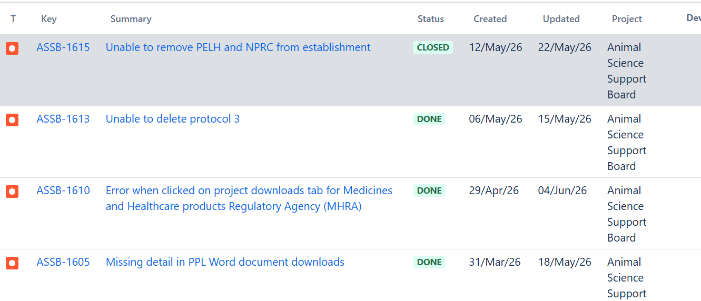
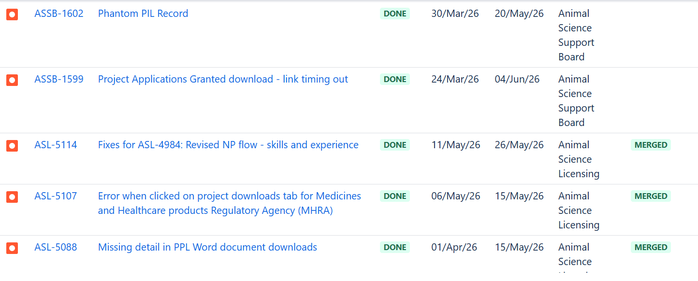

# Summary as of Wednesday 3rd June 2026

## Future research and recruitment 

Thank you for your continued involvement in user research for ASPeL– your participation is integral to understanding the user experience. The research on ASPeL features continues. Please contact ASPELTechnicalQueries@homeoffice.gov.uk to participate. Thank you.  
 
# Completed Sprint 169(Xingu river ray)

Attribution:

Interesting facts about Xingu river ray: They are fresh water fish, venomous but not aggressive.

# Completed this Sprint: 169(Xingu river ray)

1) Focused investigation to plan the update of docx in pages/projects and refactor
2) completed the update of standard import and export authorisations
3) Revised NP flow - skills and experience
4) Tech debt update: acuris - implement unsupported aws-es-connection: asl-search
5) Completed an updated to the Privacy notice on ASPeL
6) On 'fates of animals',  when "Used in other projects" is deselected, it now triggers a warning pop-up
8) Focused investigation Protocol showing new comment in historic versions
9) Named person - Minor fixes (deployment 24459)
10)Fixes for ASL-4984: Revised NP flow - skills and experience

# Bugs done or closed this Sprint

# Bugs Done or closed this Sprint pg2

# New Sprint 170(Yak)

Attribution:

# Our goals for Sprint 170(Yak)
Development:
1)Complete standard protocol Proof of Concept for Standard Protocol4
2)complete spike for Non Technical Summary(NTS.docx) bulk download
3)complete outstanding Named Person work, currently more than 90% done
4)complete all Category E PIL work on current board
5)Resolve comments display issues on ASPeL

   
  
  

   
  
  

## Things to bear in mind
Kindly let us know how we are doing in keeping you informed. We appreciate your feedback on the content of this report. Thank you.

