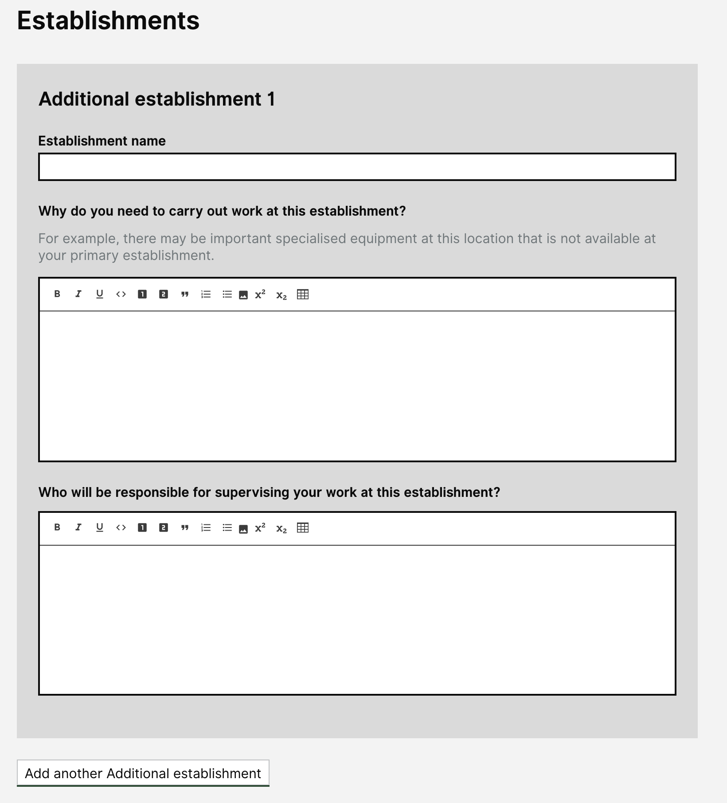

# Summary as of 3rd July 2019 

# Sprint 36 - Mid Sprint

## Just Done
* Digital views of the granted licence
* PPL file uploads design
* Working software MVP secondary availabiilty

## About to Do/Doing
* Preparation for the HOLTIF meeting
* Iterations for the Print views of the Granted Licences
* Project landing page design updates

## Things to be aware of
* We continue to work to acheive authority to operate

## Click here for Prioritised Road Map
[Prioritised Road Map](graphs/ASLRoadMap03072019.jpg)

## Click here for metrics / progress against plan
[Week 2 - Sprint 36 - Release 1](graphs/progress03072019.png)

## Burnup Chart

[Burnup Chart](burnup03072019.md)

## Risks
[Links to Project Risks in Trello](https://trello.com/b/VuFuCL7t/risk-register-and-kpis-asl-delivery) 
[Link to Risk Chart](graphs/risk03072019.png)

## Sprint Planning
* We planned the following issues in sprint planning [Link to Issues in Jira](https://jira.digital.homeoffice.gov.uk/secure/RapidBoard.jspa?rapidView=261)    [\(Cached Image\)](graphs/sprint03072019.png)

Our goals for the sprint are:
1. Complete Inspector Roadshow 
2. Prepare for HOLTIF meeting 
3. Print view PPL granted licence 
4. ATO 
5. PPL discard project amendments - design 
6. Category E Pils - (Design Only)

## Screenshots of the working software 

 

## Google Analytics for this report
[Google Analytics](graphs/GA03072019.jpg)

