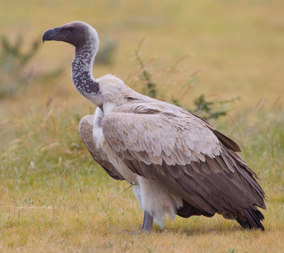

# Summary as of Wednesday 03 August 2022 

# Sprint 115 - Vulture

## Just Done
* 1st iteration of design documentation and writeup of 'suspending licences'
* Optimise task list database query to improve homepage loading times - working software
* Fix issues with enforcement flags appearing on PEL related tasks - working software
* Migrate remaining large PPLs to new image infrastructure - working software

## About to Do/Doing
* Writing up 'reusable steps' ready for development - design
* Reject a PPL - working software
* Fix issue with removing condition reminders - working software

## Bugs Fixed this week
The following bugs were fixed this week.
[Bug Fixes week to Wednesday 03 August 2022](graphs/bugs03082022.png)

We planned the following issues in this sprint 
[Sprint 115](graphs/sprint03082022.png)

## Support tickets and known issues
[Link to Support Board](https://collaboration.homeoffice.gov.uk/jira/secure/RapidBoard.jspa?rapidView=1717&selectedIssue=ASSB-253)

[Support board - cached](graphs/supportBoard03082022.png)

## Click here for metrics / progress against plan
[Sprint 115](graphs/progress03082022.png)

[Post Release Roadmap](graphs/roadmap03082022.png)

### The areas of focus for this sprint are:
1. Initial designs for guidance for PPLs 
2. Release refuse a PPL - Vulture

### The areas of focus for the previous sprint were:
1. Release refuse a PPL ***[In progress]***
2. Design specifications for reusable steps ***[In progress]***
3. HOCS Audit - umbrella bird ***[In progress]***

## Google Analytics for this report
[Google Analytics](graphs/GA03082022.png)

