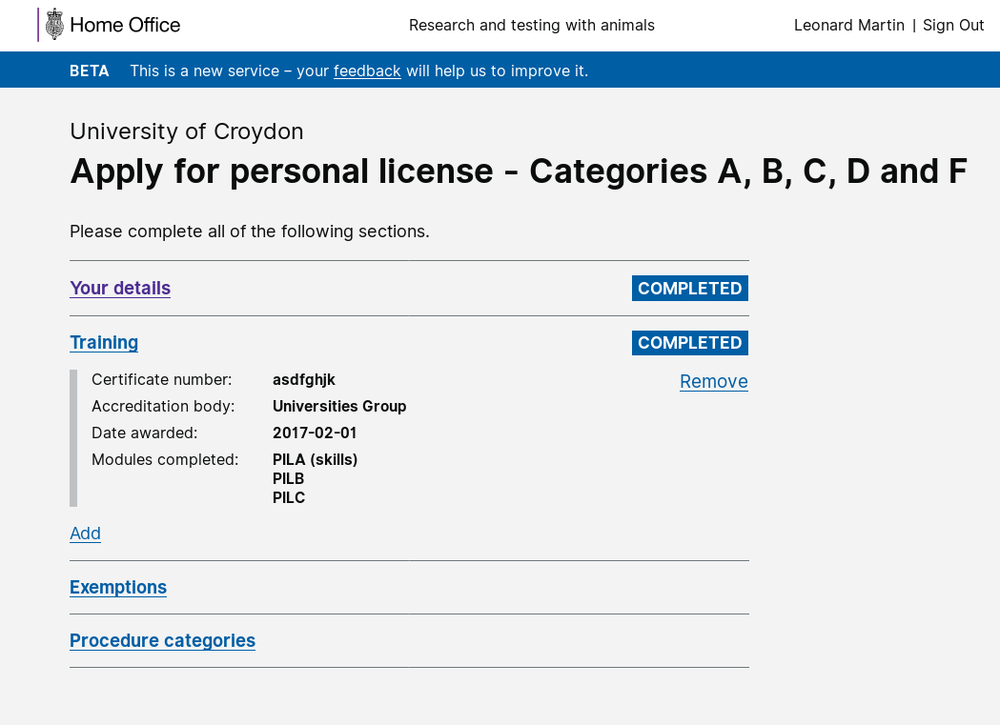

# Summary as of 3rd October 2018

# Sprint 18

## What's Blocking us / Issues
* We are still working to gain authority to operate for data migration from the existing system (first reported 19/09/2018)

## Just Done
* Delivered working software, initial implementation of workflow tasks, inspector approval
* Delivered working software PIL training add/remove
* Scope of PPL Application Form
* Complete PPL Research deep-dive (establishments and inspectors)

## About to Do/Doing
* Prepare for second Alpha assessment
* Prepare approach for testing the new PPL application designs
* Finish PILs (working software)

## Click here for our High-Level Road map
[Link to Live Road map in Trello](https://trello.com/b/gDQdE01u/asl-roadmap)    [\(Cached Image\)](graphs/ASLRoadMap03102018.jpg)

## Click here for metrics / progress against plan
[Week 1 - Sprint 19 - Release 1](graphs/progress03102018.png)

## Burnup Chart

[Burnup Chart](graphs/burnup03102018.svg)

## Risks
[Links to Project Risks in Trello](https://trello.com/b/VuFuCL7t/risk-register-and-kpis-asl-delivery)    [\(Cached Image\)](graphs/ASLRiskRegister03102018.jpg)

[Risk Management Chart](graphs/risk03102018.png)

## Sprint Planning
* We planned the following issues in sprint planning today [Link to Issues in Jira](https://jira.digital.homeoffice.gov.uk/secure/RapidBoard.jspa?rapidView=261)    [\(Cached Image\)](graphs/sprint03102018.png)

Our goals for the sprint are:
1. UR - prepare for UR testing in Sprint 19 
2. Good first design for Research PPLs (including commenting) 
3. Finish PILs (Working software)

## Sample Design Prototype

PLEASE NOTE:
The software available on this link is work in progress. Sometimes when it's accessed changes will be being made that may mean it behaves strangely, or doesn't work at all. If you see something that doesn't look right, please try logging out and logging in again.  If that doesn't work, of you have any questions, please feel free to report what you see via [animalscience@digital.homeoffice.gov.uk](animalscience@digital.homeoffice.gov.uk).
