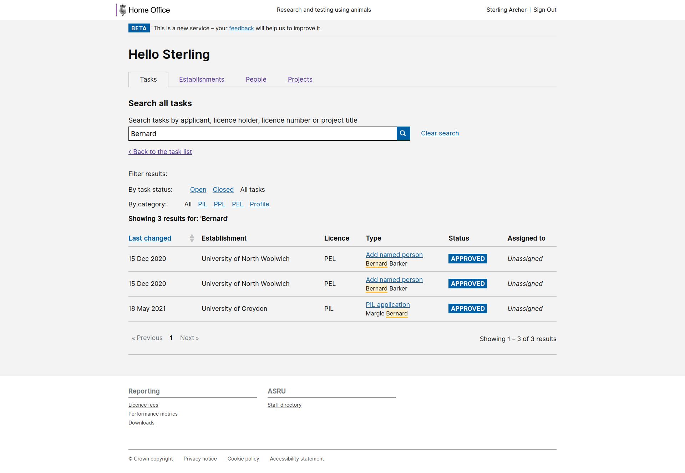

# Summary as of Wednesday 03 November 2021 

# Sprint 96 (Cow)

## Just Done
* Scheduling some more RoPs sessions - research
* Planning sessions on permissions - research
* Improved designs for PPL task filters and search - design
* Give ASRU a preview of the draft licence for PPL applications - working software
* Explain why users can't change setup questions - working software
* Change aspalondon email addresses to asrulicensing in notification emails - working software
* Show RA due date and submission date in project licences download - working software

## About to Do/Doing
* Data analysis on task filters and search - research and design
* Scheduled two feedback session on RoPs with PPL holders - research
* Reviewing permissions around PPL submissions - design
* Access to 2022 RoPs  - working software
* Add check your answers page when submitting RoPs - working software
* Show if submitted returns were overdue at the point of submission - working software

## Bugs Fixed this week
The following bugs were fixed this week.
[Bug Fixes week to Wednesday 03 November 2021](graphs/bugs03112021.png)

We planned the following issues in this sprint 
[Sprint 96](graphs/sprint03112021.png)

## Support tickets and known issues
[Link to Support Board](https://collaboration.homeoffice.gov.uk/jira/secure/RapidBoard.jspa?rapidView=1717&selectedIssue=ASSB-253)

[Support board - cached](graphs/supportBoard03112021.png)

## Click here for metrics / progress against plan
[Sprint 96](graphs/progress03112021.png)

## We set the following goals for this sprint
1. Review permissions around submitting PPLs (Design)
2. Improved visibility of overdue ROPs and RAs (Working Software)

## Screenshots of working software
### Task search

 

## Google Analytics for this report
[Google Analytics](graphs/GA03112021.png)

