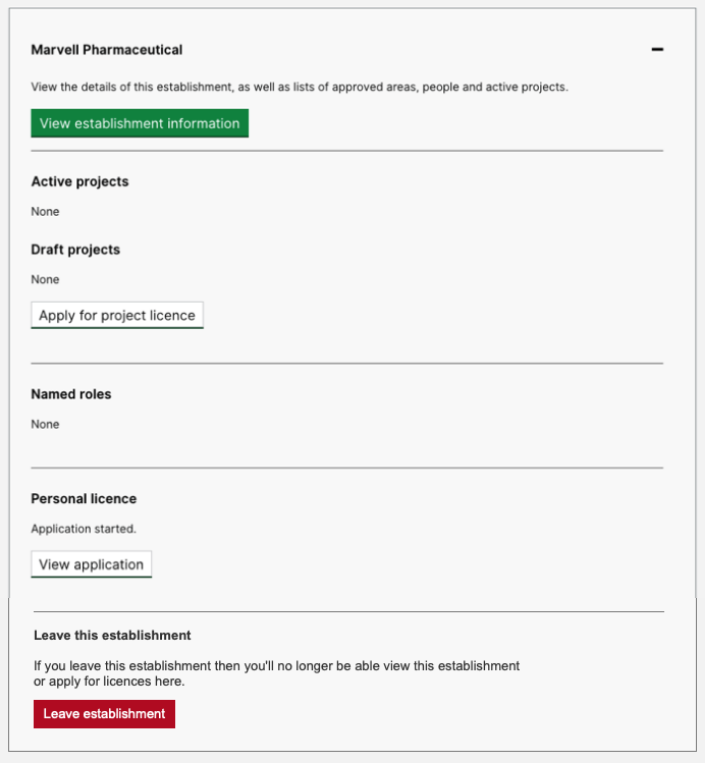

# Summary as of Wednesday 04 March 2020 

# Sprint 53

## Just Done
* Performance metric improvements
* Fix for permissions removal issue
* Content for 5 year PIL reviews
* Mapped assessment standards to new-style application
* PPL change of primary establishment
* Design for allowing users to dissassociate themselves from establishments
* Design, adding 5 keywords question for NTS's
* Design, preventing users from applying for the same named role multiple times

## About to Do/Doing
* Improve content around named roles
* Finalise assessment standards
* Digitise paper PPL - working software
* Design iterations to assessments journey

## Bugs Fixed this week
The following bugs were fixed this week.
[Bug Fixes week to Wednesday 04 March 2020](graphs/bugs04032020.png)

We planned the following issues in this sprint 
[Sprint 53](graphs/sprint04032020.png)

## Support tickets and known issues
[Link to Support Board](https://collaboration.homeoffice.gov.uk/jira/secure/RapidBoard.jspa?rapidView=1717&selectedIssue=ASSB-253)

[Support board - cached](graphs/supportBoard04032020.png)

## Click here for metrics / progress against plan
[Sprint 53](graphs/progress04032020.png)

[Post Release Roadmap](graphs/roadmap04032020.png)

Our goals for the previous sprint were:
1. Digitise PPL ***[Ongoing]***
2. User Research - Inspector assessment 3rd round ***[Done]***
3. Continue Assessment Design work ***[Ongoing]***

Our goals for the current sprint are:
1. PPL transfer - working software 
2. Digitise Paper PPL - working software 
3. Iteration of PPL assessment designs

## Sample Design Prototypes
### Iterations to assessments journey

 

## Google Analytics for this report
[Google Analytics](graphs/GA04032020.png)

