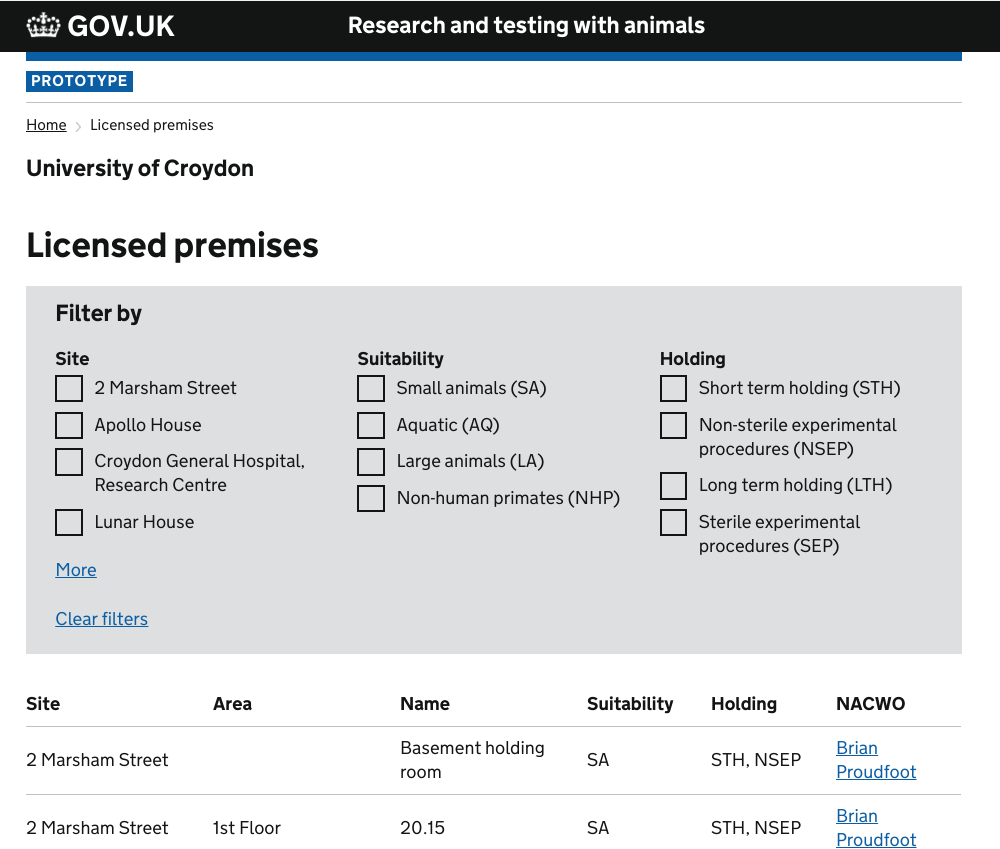
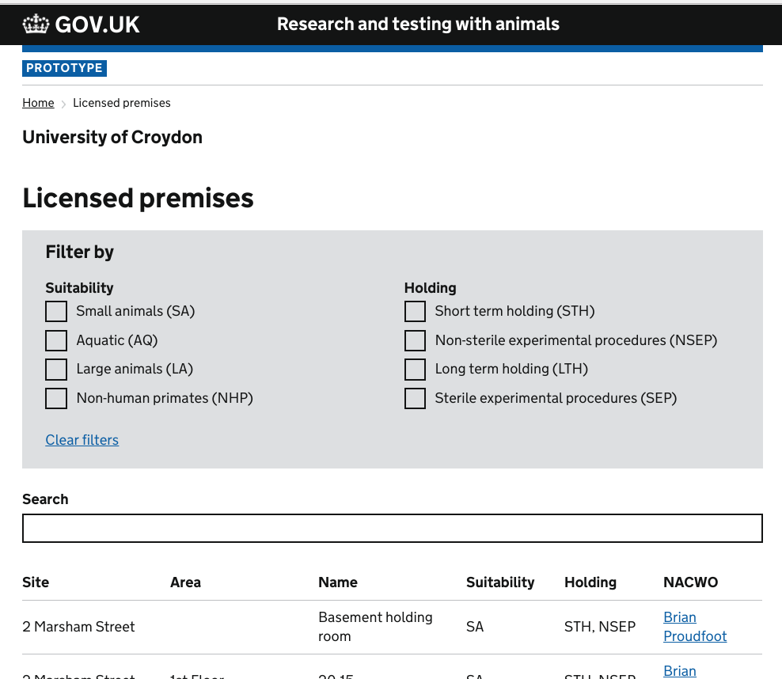

# Summary as of 4th April 2018 
## What's Blocking us / Issues
* Our desks in Lunar House have been reallocated due to underuse (cause by difficulty of access due to slow grant of security clearance)
* We are still experiencing administrative difficulties with the security clearance/Lunar House building pass process
	1. We were not notified when one team member was granted security clearance
	2. Another team member has still not been able to get a Lunar House building pass because security clearance has been granted with the wrong date of birth, despite attempts to correct the error

## Just Done
* Processed research findings resulting from the user research that we did last week at the HOLTIC meeting
* Demonstrated working software for download of filtered content to pdf

## About to Do/Doing
* Produce designs of an "ASRU view of establishments"
* Conduct futher research with the Inspectors and Licensing Team
* Develop "download to csv" functionality
* Deploy existing software to a pre-production environment

## Things to be aware of
* This was a short week since it included the Easter weekend
* A new user researcher has joined the team
* We have received all outputs from the continuous improvement unit's recommendations

## Click here for our High-Level Road map
[Link to Live Road map in Trello](https://trello.com/b/gDQdE01u/asl-roadmap)    [\(Cached Image\)](graphs/ASLRoadMap04042018.jpg)

## Click here for metrics / progress against plan
[Week 1 - Sprint 5 - Release 1](graphs/progress04042018.png)

## Risks
[Links to Project Risks in Trello](https://trello.com/b/VuFuCL7t/risk-register-and-kpis-asl-delivery)    [\(Cached Image\)](graphs/ASLRiskRegister04042018.jpg)

[Risk Management Chart](graphs/risk04042018.png)

## Sprint Planning
We planned the following issues in sprint planning today [Link to Issues in Jira](https://jira.digital.homeoffice.gov.uk/secure/RapidBoard.jspa?rapidView=261)    [\(Cached Image\)](graphs/sprint04042018.jpg)

Our three goals for the sprint are:
* Deploy existing software to pre production environments
* Explore the end to end service using service mapping
* Explore the ASRU View of Establishment data

## Working Prototype Demonstrations
Log in to these technical prototypes with username “holc” and password “holc”
*These are early technical prototypes, the designs may change substantially*
* Demonstrates [download to pdf of filtered data](http://public-ui.notprod.asl.homeoffice.gov.uk/places)

* Demonstrates [addition of search to data filtering](http://public-ui.notprod.asl.homeoffice.gov.uk/search)

