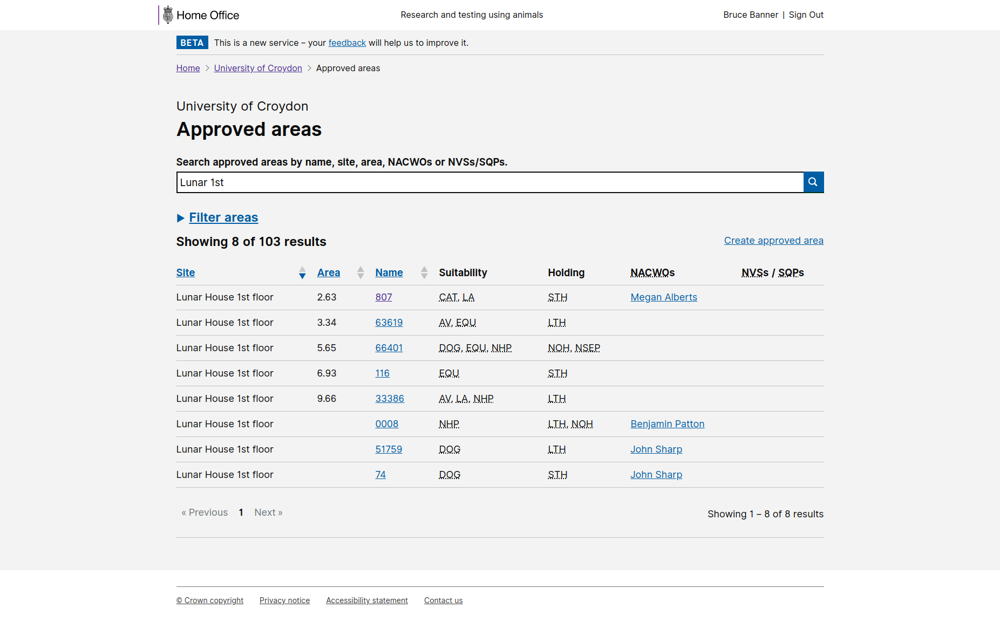

# Summary as of Wednesday 04 November 2020 

# Sprint 70 &#x1F965;

## Just Done
* Backend data API services for supporting additional availability on PPLS - working software
* Added establishment and date range filters to task completion metrics page - working software
* Digital view of NTS - working software
* Free text search on schedule of premises - working software

## About to Do/Doing
* Release additional availability - working software
* General PPL UI improvements - working software

## Bugs Fixed this week
The following bugs were fixed this week.
[Bug Fixes week to Wednesday 04 November 2020](graphs/bugs04112020.png)

We planned the following issues in this sprint 
[Sprint 70](graphs/sprint04112020.png)

## Support tickets and known issues
[Link to Support Board](https://collaboration.homeoffice.gov.uk/jira/secure/RapidBoard.jspa?rapidView=1717&selectedIssue=ASSB-253)

[Support board - cached](graphs/supportBoard04112020.png)

## Click here for metrics / progress against plan
[Sprint 70](graphs/progress04112020.png)

[Post Release Roadmap](graphs/roadmap04112020.png)

[Roadmap Visualisaton (Experimental) ](roadmapVisualisation04112020.md)

## The goals for this sprint (Coconut) are:
1. Prepare for testing the "Returns of Procedures" prototype and high-level user journey - research and design 
2. Additional availability release candidate - development (sprint name - Coconut)

## Sample Design Prototypes

 

 

## Google Analytics for this report
[Google Analytics](graphs/GA04112020.png)

