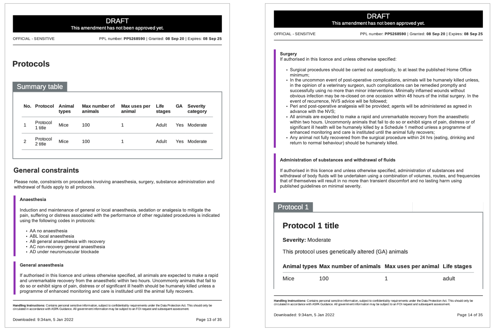

# Summary as of Wednesday 05 January 2022 

# Sprint 100

## Just Done
* Adding general constraints to PPL application / amendment downloads - design
* Making homepage notification banners more consistent - design
* Capture internal deadlines for PPL tasks for ASRU - working software
* Include warning about endorsement and AWERBs on PPL submissions - working software 

## About to Do/Doing
* Designing compliance flags flow for user testing - design
* Updates to homepage notification banners - working software
* General constraints not auto generated in download of complete application - pdf and word downloads - working software

## Bugs Fixed this week
The following bugs were fixed this week.
[Bug Fixes week to Wednesday 05 January 2022](graphs/bugs05012022.png)

We planned the following issues in this sprint 
[Sprint 100](graphs/sprint05012022.png)

## Support tickets and known issues
[Link to Support Board](https://collaboration.homeoffice.gov.uk/jira/secure/RapidBoard.jspa?rapidView=1717&selectedIssue=ASSB-253)

[Support board - cached](graphs/supportBoard05012022.png)

## Click here for metrics / progress against plan
[Sprint 100](graphs/progress05012022.png)

[Post Release Roadmap](graphs/roadmap05012022.png)

## We set the following goals for this sprint
1. Initial designs for compliance - design flags 
2. Internal target reporting - working software 
3. Schedule sessions for compliance flags designs - user research

## Sample Design Prototypes
### Adding general constraints to PPL application / amendment downloads

 

## Google Analytics for this report
[Google Analytics](graphs/GA05012022.png)

