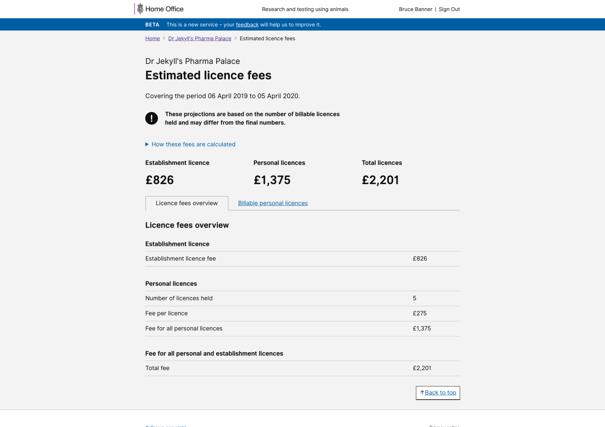
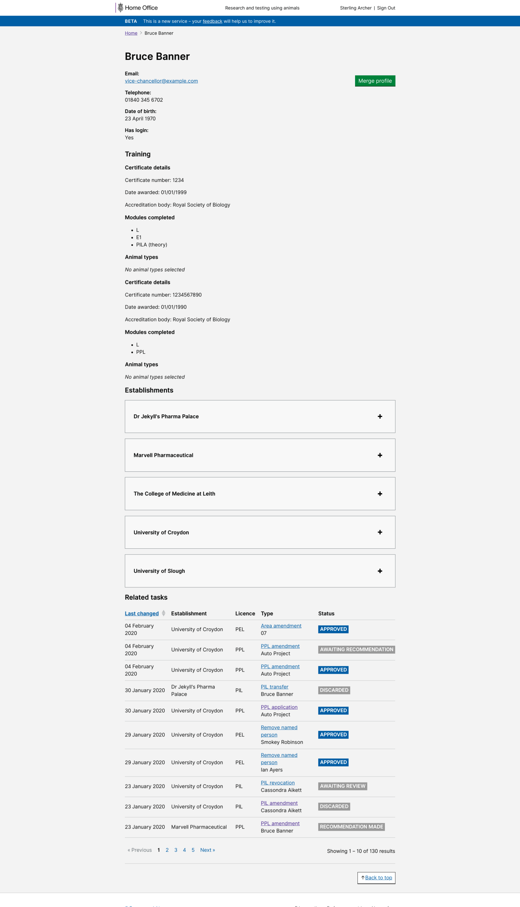

# Summary as of Wednesday 05 February 2020 

# Sprint 51

## Just Done
* Working software - make billing information available to establishments 
* User research - General feedback and redesigning assessment sessions with inspectors
* Improve PIL amendment designs for editing Establishment (PIL transfers)

## About to Do/Doing
* Digitise Paper Legacy Licenses
* User research - returns of procedures
* Show secondary availability on PPLs

## Bugs Fixed this week
The following bugs were fixed this week.
[Bug Fixes week to Wednesday 05 February 2020](graphs/bugs05022020.png)

We planned the following issues in this sprint 
[Sprint 51](graphs/sprint05022020.png)

## Support tickets and known issues
[Link to Support Board](https://collaboration.homeoffice.gov.uk/jira/secure/RapidBoard.jspa?rapidView=1717&selectedIssue=ASSB-253)

[Support board - cached](graphs/supportBoard05022020.png)

## Click here for metrics / progress against plan
[Sprint 51](graphs/progress05022020.png)

[Post Release Roadmap](graphs/roadmap05022020.png)

Our goals for the previous sprint were:
1. Dev and Design - improve PPL downloads ***[Step 1]***
2. UR - engage with inspectorate ***[Done and Ongoing]***
3. Content - gov.uk updates ***[Awaiting ASRU approval]***

Our goals for the current sprint are:
1. Digitise paper licences - working software 
2. New designs for 5yr PIL review 
3. Improve content for transfer and amendment of PILs

## Sample Design Prototypes

 

 

## Google Analytics for this report
[Google Analytics](graphs/GA05022020.png)

