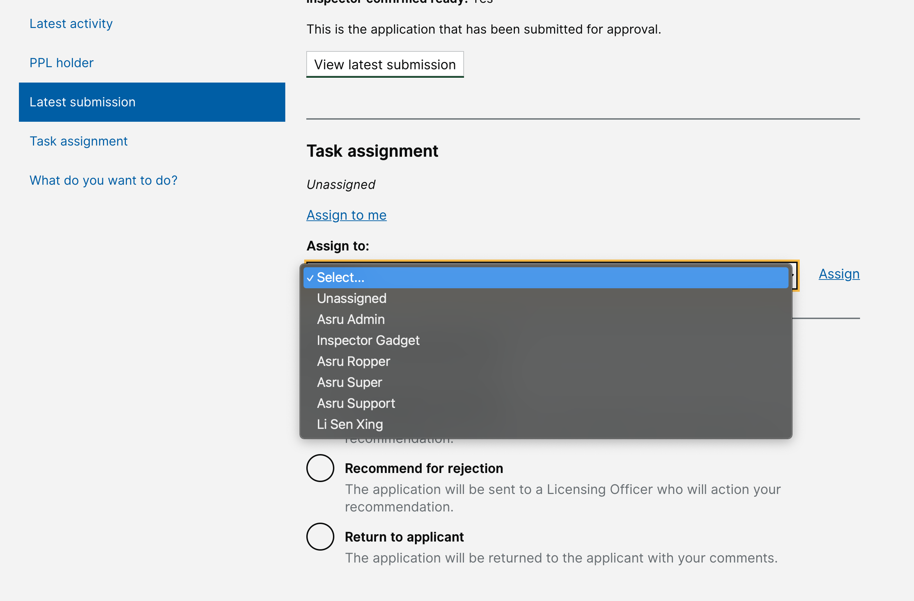

# Summary as of Wednesday 05 May 2021 

# Sprint 83

## Just Done
* TEXT_HERE
* TEXT_HERE
* TEXT_HERE

## About to Do/Doing
* TEXT_HERE
* TEXT_HERE
* TEXT_HERE

## Bugs Fixed this week
The following bugs were fixed this week.
[Bug Fixes week to Wednesday 05 May 2021](graphs/bugs05052021.png)

We planned the following issues in this sprint 
[Sprint 83](graphs/sprint05052021.png)

## Support tickets and known issues
[Link to Support Board](https://collaboration.homeoffice.gov.uk/jira/secure/RapidBoard.jspa?rapidView=1717&selectedIssue=ASSB-253)

[Support board - cached](graphs/supportBoard05052021.png)

## Click here for metrics / progress against plan
[Sprint 83](graphs/progress05052021.png)

[Post Release Roadmap](graphs/roadmap05052021.png)

Initial release of changes to ASRU workflow (assignment of tasks, inspectors can grant licences) - pterodactyl

Send expiry notifications for PPLs (working software) Ocelot

## Sample Design Prototypes

 

 

## Google Analytics for this report
[Google Analytics](graphs/GA05052021.png)

