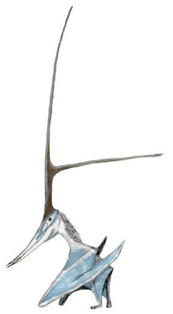
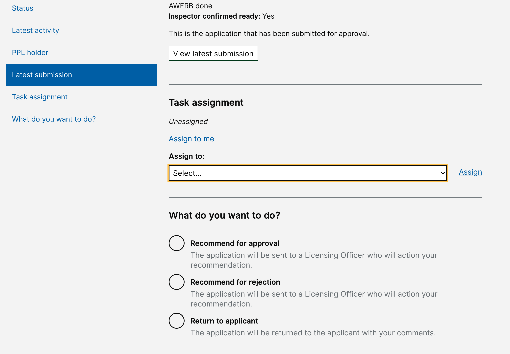

# Summary as of Wednesday 05 May 2021 

# Sprint 83 - (pterodactyl)

## Just Done
* Assignment of tasks within ASRU - working software
* Improved reporting of overdue ROP submissions - working software
* Inclusion of all projects in establishment level CSV download of project data - working software
* Fixed issues updating email preferences affecting some users - working software

## About to Do/Doing
* Show inactive PPLs on a user’s profile
* Add ASRU data exports and reporting for PPL protocols
* Improve navigation in PPL review screens

## Bugs Fixed this week
The following bugs were fixed this week.
[Bug Fixes week to Wednesday 05 May 2021](graphs/bugs05052021.png)

We planned the following issues in this sprint 
[Sprint 83](graphs/sprint05052021.png)

## Support tickets and known issues
[Link to Support Board](https://collaboration.homeoffice.gov.uk/jira/secure/RapidBoard.jspa?rapidView=1717&selectedIssue=ASSB-253)

[Support board - cached](graphs/supportBoard05052021.png)

## Click here for metrics / progress against plan
[Sprint 83](graphs/progress05052021.png)

[Post Release Roadmap](graphs/roadmap05052021.png)

### We planned this goal for the current sprint 83 (pterodactyl)
Initial release of changes to ASRU workflow - assignment of tasks, reviewing the granting process for each licence type (working software)

## Sample Design Prototypes

 

## Google Analytics for this report
[Google Analytics](graphs/GA05052021.png)

