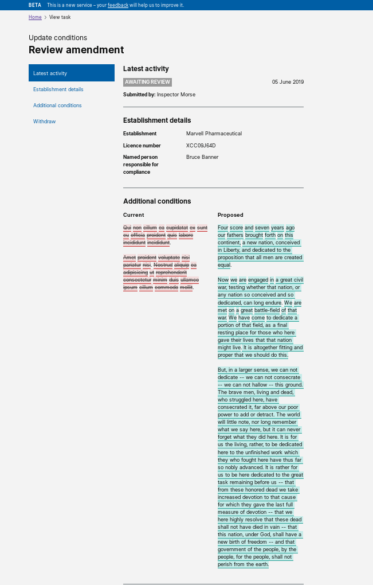

# Summary as of 5th June 2019 

# Sprint 34 mid-sprint

## What's Blocking us / Issues
* Access to document attachments has been identified as a risk, this has resulted in a substantial increase in the exposure score in the risk management chart.

## Just Done
* ITHC/Pen testing - report pending.
* Review PPL status banners for draft applications and amendements
* Add facility for ASRU users to edit PEL conditions
* Resolve a number of identified issues with data migration
* Design: View of granted licences -  Iterations for testing
* Research debriefs on testing for conditions and authorisations and views of the granted PPL
* Tested Halloween data with an establishment
* Held a prep session with a licensing officer trying tasks in the new ASPeL

## About to Do/Doing
* PPL version comparison
* License status banners
* Authorisations and conditions design handover
* Preparing for the new ASPeL roadshow
* Testing the system with establishment users, using 'Halloween' data
* Planning presentation  at the HOLTIF meeting

## Things to be aware of
* A designer is leaving the team this week, a new head of design will join the team next week 

## Click here for Prioritised Road Map
[Prioritised Road Map](https://trello.com/b/p7x9hbPV/prioritised-roadmap)    [\(Cached Image\)](graphs/ASLRoadMap05062019.jpg)

## Click here for metrics / progress against plan
[Sprint 34 - Week 1 - Release 1](graphs/progress05062019.png)

## Burnup Chart
[Burnup Chart](burnup05062019.md)

## Risks
[Links to Project Risks in Trello](https://trello.com/b/VuFuCL7t/risk-register-and-kpis-asl-delivery) 
[Link to Risk Chart](graphs/risk05062019.png)

## Sprint Planning
* We planned the following issues in sprint planning today [Link to Issues in Jira](https://jira.digital.homeoffice.gov.uk/secure/RapidBoard.jspa?rapidView=261)    [\(Cached Image\)](graphs/sprint05062019.png)

### Our goals for the current sprint are
1. Halloween data testing 
2. End to end test ASRU/Establishments 
3. Dev Conditions and authorisations for PILs and PELs 
4. PEL Details amendments 
5. Design views of granted PPLs (including legacy)

## Screenshots of the PPL application prototype

 

 

## Google Analytics for this report

[Google Analytics](graphs/GA05062019.jpg)

