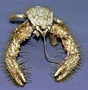
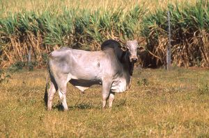

# Summary as of Wednesday 05th June 2024

## Future research and recruitment 

Thank you for your continued involvement in user research – your participation is integral to understanding the user experience on ASPeL. The research on the Named Persons journey continues.  
 

Please note that the link to the Roadmap is no longer available here.

Completed Sprint 144 (Yeti Crab)

Fun facts about Yeti Crab: Yeti Crab have a unique way of farming for food, which has made the species become known as the "dancing crab".

# Completed this Sprint: 144 Yeti Crab
1) We added the HBA upload functionality in PPL transfer journeys
2) We corrected the comment indicator not showing on reusable steps
3) We presented a Show and Tell on Digital product lifecycle 
4) We continued the design for other named person roles in ASPeL
5) In Design, we considered the inspector task screens for named person applications
6) We designed NVS and NACWO training modules that are currently missing to the Design in ASPeL
7) We presented the Standard Protocols research findings and next steps back to ASRU
8) We Updated the deployment pipeline to re-run failed tests more efficiently, thereby, improving test performance.

# Bugs Fixed this Sprint
1) The reports by users that the comment indicator was not showing on reusable steps was fixed
2) Users reports that they were unable to download DOCX version of project licence amendments was fixed
3) The NTS download of Draft Project licences which was reported by users to be failing, was fixed

# New Sprint: 145(Zebu)

Fun facts about Zebu: Zebus are in the cattle family but musch smaller, they are sacred in India, where they are used only as draft animals, and for producing milk.

 

## Planned for Sprint 145 (Zebu)
1) We are starting Development work to implement a better user experience for those choosing to keep animals alive	on ASPeL	
2) Our user researcher is aiming to recruit external users for usability research on the Named People journey
3) We will continue to onboard additional joiners as they land
4) We are start work to further reduce the Tech Debt on ASPeL
5) We will be planning the work that will ensure ASPeL is compliant with accessibility standards
6) Developers will review and apply fixes to issues reported on reusable steps which meant that the highlighting were inconsistent with expectations 
7) We will define content and behaviour requirements for one Standard protocol ahead of design work on project licence improvements

   

## Things to bear in mind
Kindly let us know how we are doing in keeping you informed. We appreciate your feedback on the content of this report.

# Work in progress
1) Improvements to the user experience when making the choice of Keeping animals alive on ASPeL
  

   
 
   
## Support tickets and known issues
[Link to Support Board](https://collaboration.homeoffice.gov.uk/jira/secure/RapidBoard.jspa?rapidView=1717)

