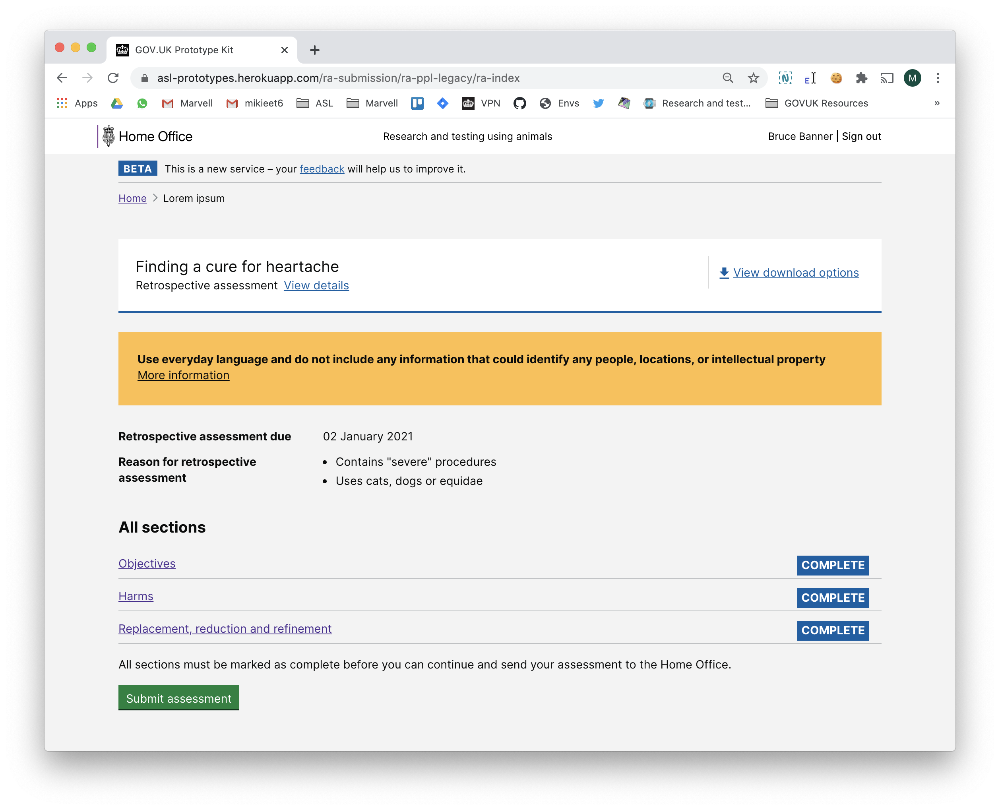

# Summary as of Wednesday 05 August 2020 

# Sprint 64

## Just Done
* TEXT_HERE
* TEXT_HERE
* TEXT_HERE

## About to Do/Doing
* TEXT_HERE
* TEXT_HERE
* TEXT_HERE

## Bugs Fixed this week
The following bugs were fixed this week.
[Bug Fixes week to Wednesday 05 August 2020](graphs/bugs05082020.png)

We planned the following issues in this sprint 
[Sprint 64](graphs/sprint05082020.png)

## Support tickets and known issues
[Link to Support Board](https://collaboration.homeoffice.gov.uk/jira/secure/RapidBoard.jspa?rapidView=1717&selectedIssue=ASSB-253)

[Support board - cached](graphs/supportBoard05082020.png)

## Click here for metrics / progress against plan
[Sprint 64](graphs/progress05082020.png)

[Post Release Roadmap](graphs/roadmap05082020.png)

## These are the goals for the current sprint:

1. Design - NTS Improvements 
2. Create a training course with Cat E PILs - working software 
3. Iterate RA prototypes - content design

## These were the goals for the previous sprint:

1. Design and Content - Prototype for submission of a retrospective assessment 
2. Working Software - Training profiles 
3. User Research - complete prototype testing for RA submission

## Sample Design Prototypes

 

 

## Google Analytics for this report
[Google Analytics](graphs/GA05082020.png)

