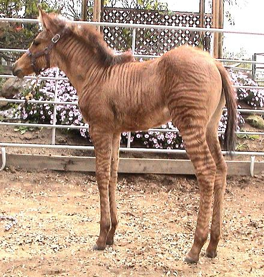

# Summary as of Wednesday 05 October 2022 

# Sprint 119 (Zorse)

## Just Done
* Investigate regression test options for images in Word documents - working software
* "Next steps" text and "Next Steps" button when viewing a submitted draft PPL - working software
* (ITHC) Keycloak - Session Not Invalidated upon Change of Password - working software

## About to Do/Doing
* Add messages to profiles where they have been merged - design
* Add guidance to the PPL application - design
* Design where links to PPL guidance should live - design
* Improve prioritisation of options on homepage - design
* Additional condition for cosmetic use - working software
* Include search for enforcement cases _ working sotware
* Can't past text into a table in the RTE for the PPL - working software
* Reusable steps - working software

## Bugs Fixed this week
The following bugs were fixed this week.
[Bug Fixes week to Wednesday 05 October 2022](graphs/bugs05102022.png)

We planned the following issues in this sprint 
[Sprint 119](graphs/sprint05102022.png)

## Support tickets and known issues
[Link to Support Board](https://collaboration.homeoffice.gov.uk/jira/secure/RapidBoard.jspa?rapidView=1717&selectedIssue=ASSB-253)

[Support board - cached](graphs/supportBoard05102022.png)

## Click here for metrics / progress against plan
[Sprint 119](graphs/progress05102022.png)

[Post Release Roadmap](graphs/roadmap05102022.png)

### Ther are the areas of focus for this sprint
1. Reusable steps - release 
2. Various improvements to messaging - design

## Sample Design Prototypes

 

 

## Google Analytics for this report
[Google Analytics](graphs/GA05102022.png)

