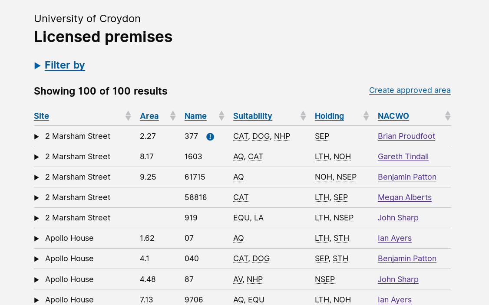

# Summary as of 5th December 2018 
## What's Blocking us / Issues
* RRRTEXT_FILL

## Just Done
* Shared findings from PPL testing
* Reviewed PPL application for next round of testing

## About to Do/Doing
* Designing the next PPL application iteration
* Planning further research in January

## Things to be aware of
* RRRTEXT_FILL
## Click here for our High-Level Road map
[Link to Live Road map in Trello](https://trello.com/b/gDQdE01u/asl-roadmap)    [\(Cached Image\)](graphs/ASLRoadMap05122018.jpg)

## Click here for metrics / progress against plan
[RRRWEEK_SPRINT_RELEASE](graphs/progress05122018.png)

## Burnup Chart

[Burnup Chart](burnup05122018.md)

## Risks
[Links to Project Risks in Trello](https://trello.com/b/VuFuCL7t/risk-register-and-kpis-asl-delivery)    [\(Cached Image\)](graphs/ASLRiskRegister05122018.jpg)

[Risk Management Chart](graphs/risk05122018.png)

## Sprint Planning
* We planned the following issues in sprint planning today [Link to Issues in Jira](https://jira.digital.homeoffice.gov.uk/secure/RapidBoard.jspa?rapidView=261)    [\(Cached Image\)](graphs/sprint05122018.png)

### Our goals for the sprint are:
1. Content Design - Full PPL Research Application
2. UR - Playback findings from LASA and ASRU
3. Build PPL Prototype

## "University of Croydon" Test Environment 

### Screenshots

 
 

### Need a test account?
If you need a test account please contact [animalscience@digital.homeoffice.gov.uk](mailto://animalscience@digital.homeoffice.gov.uk)

