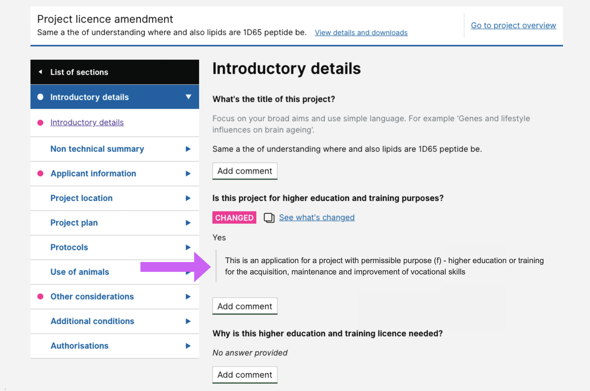

# Summary as of Wednesday 06 January 2021 

# Sprint 75 &#129435;

## Just Done
* Designs for stating when a project has permissible purpose F for reviewers
* Continued development on RA submission
* Improved granularity of PPL comparisons for large inputs - working software
* Fixed issue with sorting of schedule of premises records - working software

## About to Do/Doing
* Preparing to test RoPs workflows with stats team and policy - user research
* Improvements to banners on the PPL overview page - design
* Continuing development of RA submission - working software
* Release of advanced PPL content search - working software

We planned the following issues in this sprint 
[Sprint 75](graphs/sprint06012021.png) &#129435;

## Support tickets and known issues
[Link to Support Board](https://collaboration.homeoffice.gov.uk/jira/secure/RapidBoard.jspa?rapidView=1717&selectedIssue=ASSB-253)

[Support board - cached](graphs/supportBoard06012021.png)

## Click here for metrics / progress against plan
[Sprint 75](graphs/progress06012021.png)

[Post Release Roadmap](graphs/roadmap06012021.png)

## These are the goals for the current sprint (Hippo) &#129435;
1. Complete RoPs testing with internal users - user research 
2. RA release candidate - working software

## These were the goals for the previous sprint (Turkey) &#129411;
1. Have a merry (stable) Xmas ***[Done]*** 
2. Convert PPL expiry letters into email notifications - content design ***[In Progress]***

## Sample Design Prototypes

 

## Google Analytics for this report
[Google Analytics](graphs/GA06012021.png)

