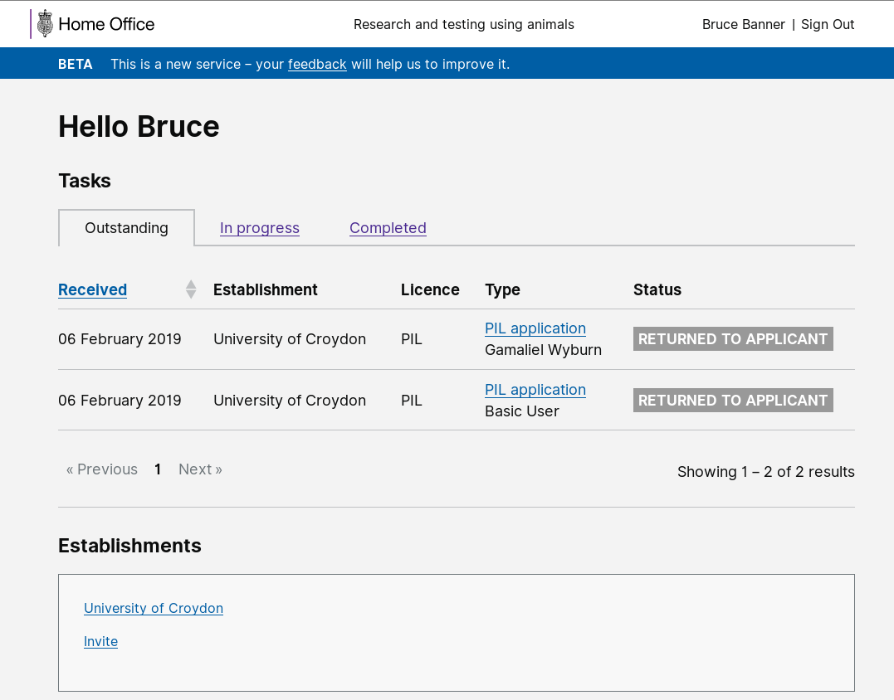
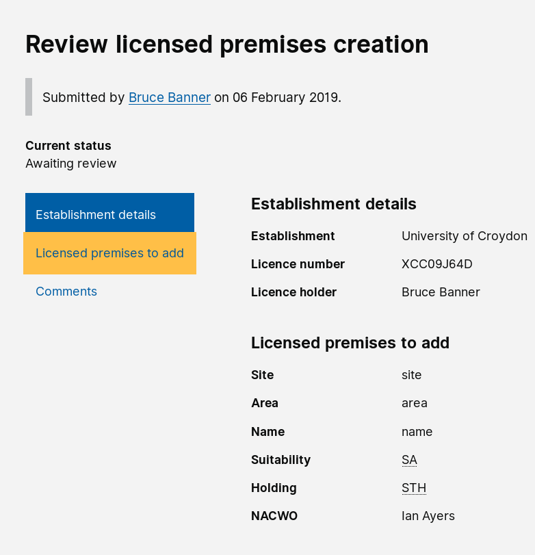

# Summary as of 6th February 2019 

# Sprint 26

## What's Blocking us / Issues
* The current limiting factor on the speed of development is release of the PPL drafting tool to establishment users

## Just Done
* Release Draft Tool PPL
* Designs for test with inspectors of PPL application review
* Demonstrated PPL Word document export
* Demonstrated review and approval screens for all tasks that are representable

## About to Do/Doing
* Carry out PPL review research with inspectors and establishment users
* Prepare for service assessment
* Release PPL drafting tool to establishments
* Continue development work on Word download, PPL drafting tool, task approval

## Things to be aware of
* We are looking to share the PPL drafting tool to the wider inspectorate in this sprint and to release it to establishment users on February 13th
* We have identified a possible issue with the version of Microsoft Edge which is available on POISE  

## Click here for Prioritised Road Map
[Prioritised Road Map](https://trello.com/b/p7x9hbPV/prioritised-roadmap)    [\(Cached Image\)](graphs/ASLRoadMap06022019.jpg)

## Click here for metrics / progress against plan
[Week 1 - Sprint 26 - Release 1](graphs/progress06022019.png)

## Burnup Chart

[Burnup Chart](burnup06022019.md)

## Risks
[Links to Project Risks in Trello](https://trello.com/b/VuFuCL7t/risk-register-and-kpis-asl-delivery) 

[Risk Management Chart](graphs/risk06022019.png)

## Sprint Planning
* We planned the following issues in sprint planning today [Link to Issues in Jira](https://jira.digital.homeoffice.gov.uk/secure/RapidBoard.jspa?rapidView=261)    [\(Cached Image\)](graphs/sprint06022019.png)

Our goals for previous sprint were:
1. Release Draft Tool PPL
\[Released to core group of inspectors\]
2. PPL Review & agree with team and PO
\[Done\]
3. Designs for test with inspectors PPL app review
\[Done\]
4. PPL Document Export
\[Done\]
5. Review and approval screens for all tasks that are representable
\[Done\]

Our goals for the sprint are:
1. Carry out PPL review research with inspectors and establishment users 
2. Prepare for service assessment 
3. Release PPL drafting tool to establishments 
4. Get ASRU users to log into the system

## Screenshots of the PPL application prototype

 
 

## Google Analytics for this report

This shows:
* total number of users
* number of new users

[Google Analytics](graphs/GA06022019.jpg)

