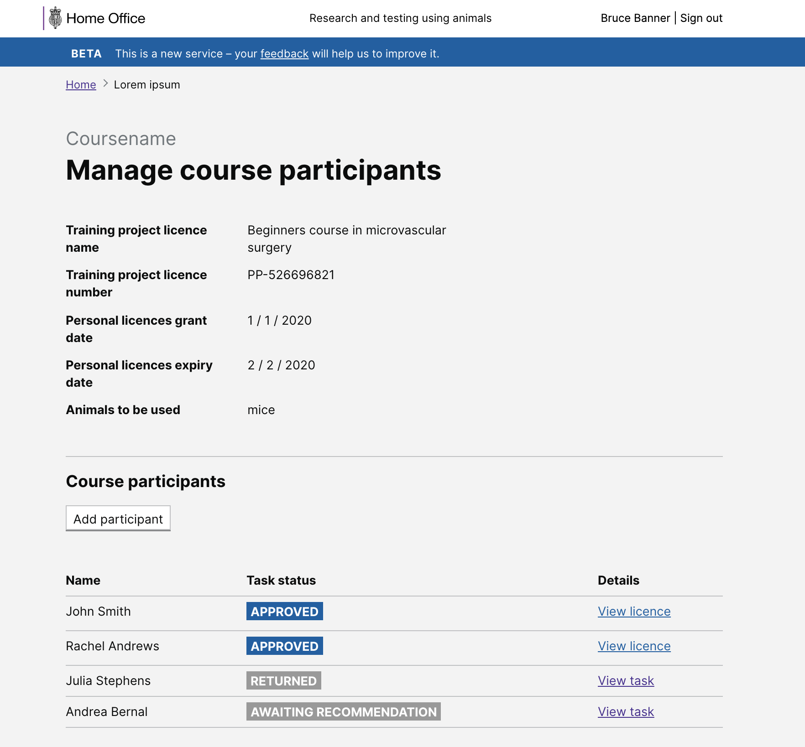

# Summary as of Wednesday 06 May 2020 

# Sprint 57

## Just Done
### Fix profile update notifications (working software)
Profile updates which were review by ASRU (name and dob changes of licence holders) were not correctly sending email notifications when complete. This is now fixed.
### Add project continuation metadata to PPL application tasks (working software)
Project applications which include a continuation of a previous PPL now include flags on the task list and show continuation metadata in the task view screen
### Experimental widescreen feature (working software)
New UI theme using additional screen width has been launched for beta testing. To enable add:

`?widescreen=true` 

to the end of the url in the browser address bar. Feedback on any visual issues is appreciated.
So the external site can be viewed using [https://external.aspel.homeoffice.gov.uk/?widescreen=true](https://external.aspel.homeoffice.gov.uk/?widescreen=true).
And the internal site can be viewed using [https://internal.aspel.homeoffice.gov.uk/?widescreen=true](https://internal.aspel.homeoffice.gov.uk/?widescreen=true).

### Prompt to complete survey (content design)
We are running a user satisfaction survey. To increase responses, some text has been written to add to the Beta banner. 
### Fix to confirmation message (content design)
Currently when a user makes someone a HOLC the confirmation message is incorrect. That message has been corrected and is waiting to be made live in the system. 
### Hint text for holding area (content design)
We have created some hint text to explain how long animals can be held under a short term holding.
### Applying for Category E PILs (design iteration)
### Preparation for testing PIL E designs with users (user research)
### Tested PIL E designs with two training and education establishments (user research)

## About to Do/Doing
### Multiple place-role assignments (working software)
Allow establishments to assign more than one NACWO to each area in their schedule of premises. Additionally allow assigning NVS/SQPs to areas.
### Project protocol summary (working software)
Provide a quick summary of protocol data across a project.
### PIL E journey content (content design)
Content and notifications are needed for admins who want to apply for PIL E licences. The content has been written and is being tested and iterated.
### Declaration for admins submitting PPLs (content design)
Admins who submit PPL applications need to understand that by submitting a PPL they are endorsing it on behalf of the establishment licence holder. That message is being worked on.
### Training modules and exemptions (content design)
A journey for people to add training modules to their profile or ask for an exemption is being designed. Content is being created as part of that work. 
### Improvements to how we handle users training and exemptions (design)
### Testing PIL E designs with one training and education establishment (user research)
### Testing PIL E designs with two inspectors (user research)

## Bugs Fixed this week
The following bugs were fixed this week.
[Bug Fixes week to Wednesday 06 May 2020](graphs/bugs06052020.png)

We planned the following issues in this sprint 
[Sprint 57](graphs/sprint06052020.png)

## Support tickets and known issues
[Link to Support Board](https://collaboration.homeoffice.gov.uk/jira/secure/RapidBoard.jspa?rapidView=1717&selectedIssue=ASSB-253)

[Support board - cached](graphs/supportBoard06052020.png)

## Click here for metrics / progress against plan
[Sprint 57](graphs/progress06052020.png)

[Post Release Roadmap](graphs/roadmap06052020.png)

Our goals for the current sprint are:
1. Multiple people on SOP 
2. Design Adding training modules to people's profiles 
3. User Research complete PIL E research

## Sample Design Prototypes

 

## Google Analytics for this report
[Google Analytics](graphs/GA06052020.png)

