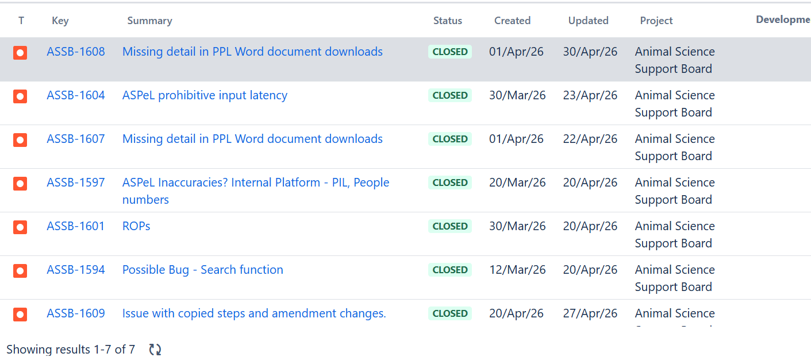

# Summary as of Wednesday 6th May 2026

## Future research and recruitment 

Thank you for your continued involvement in user research for ASPeL– your participation is integral to understanding the user experience. The research on ASPeL features continues. Please contact ASPELTechnicalQueries@homeoffice.gov.uk to participate. Thank you.  
 
# Completed Sprint 168(whimbrel)

Attribution:

Interesting facts about whimbrel:They have a curved beak and a thrilling whistle

# Bugs done or closed this Sprint

# Delays caused by a broken test pipeline meant that we did not deploy into production any of the fixed bugs at the end of the Sprint. These will be reported at the end of the current Sprint.

# New Sprint 169(Xingu river ray)

Attribution:

Interesting facts about Xingu river ray: They are fresh water fish, venomous but not aggressive.

# Our goals for Sprint 169(Xingu river ray)
Development:
1)complete standard protocol Proof of Concept for Standard Protocol4
2)complete update to import and export authorisations
3)complete spike for Non Technical Summary(NTS.docx) bulk download
4)complete outstanding Named Person work, currently more than 90% done
5)complete all Category E PIL work on current board

Design:
1)validate the standard protocols Proof of Concept with users 
2)complete design for NTS download screen
3)provide support on completing named person work

   
  
  

## Things to bear in mind
Kindly let us know how we are doing in keeping you informed. We appreciate your feedback on the content of this report. Thank you.

