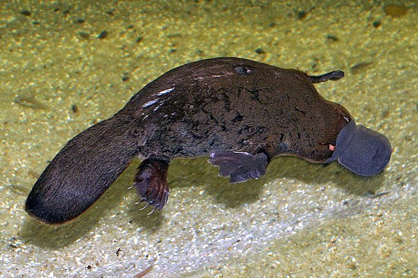

# Summary as of Wednesday 06th September 2023

## New Features 
### **Harm/Benefit Document**
Thank you for the feedback on the HBA document upload, we are working on the improvements and you should see the changes shortly.

**Named Person Research**

Thank you to everyone who has expressed an interest in taking part in the Named Person research, our User Researcher will contact you. 

Don't forget to check out our [roadmap](https://roadmap.prodpad.com/937455be-8d08-11ed-aa53-2a7db0eb1d9c) to see what's coming next to ASPeL.

# Completed Sprint: 135 (Platypus)
Attribution:

*Confirm design and content for NTCO licence endorsement screen*
*Design for inspector licence approval screen*

## Bugs Fixed this Sprint
The following bugs were fixed in this sprint.
[Bug Fixes week to Wednesday 09th August 2023](graphs/Bugs09082023.jpg)

 
# New Sprint: 136 (Quokka)

Attribution:

## Planned for Sprint 136 (Quokka)
1) Get the PIL E journey signed off and handover for development. 
2) Finish upgrading of WDIO if able to focus fully on the pipeline.
3) Get familiar with the named person journey.

## Things to bear in mind
Let us know how we are doing in keeping you informed. We appreciate your feedback on the content of this report.

# Work in progress

## Support tickets and known issues
[Link to Support Board](https://collaboration.homeoffice.gov.uk/jira/secure/RapidBoard.jspa?rapidView=1717)

