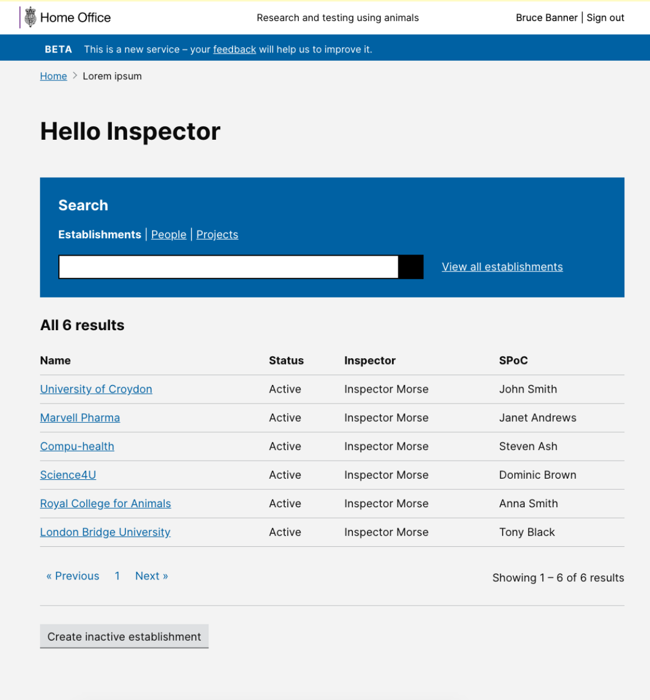

# Summary as of Wednesday 06 November 2019 

# Sprint 45

## Just Done
* Design - Creating an inactive establishment 
* Presented at the HOLTIF meeting
* Observed AWERB review at an establishment

## About to Do/Doing
* Carrying out a holistic review of notifications
* TEXT_HERE
* TEXT_HERE

## Bugs Fixed this week
The following bugs were fixed this week.
[Bug Fixes week to Wednesday 06 November 2019](graphs/bugs06112019.png)

We planned the following issues in this sprint 
[Sprint 45](graphs/sprint06112019.png)

## Support tickets and known issues
[Link to Support Board](https://jira.digital.homeoffice.gov.uk/secure/RapidBoard.jspa?rapidView=331&selectedIssue=ALS-47)

[Support board - cached](graphs/supportBoard06112019.jpg)

## Click here for metrics / progress against plan
[Sprint 45](graphs/progress06112019.png)

[Post Release Roadmap](graphs/roadmap06112019.png)

Our goals for the current sprint are:
1. 5 year PIL review design 
2. New PPL optimisation - working software 
3. Organise UR for establishment billing

## Sample Design Prototypes

 

## Google Analytics for this report
[Google Analytics](graphs/GA06112019.png)

