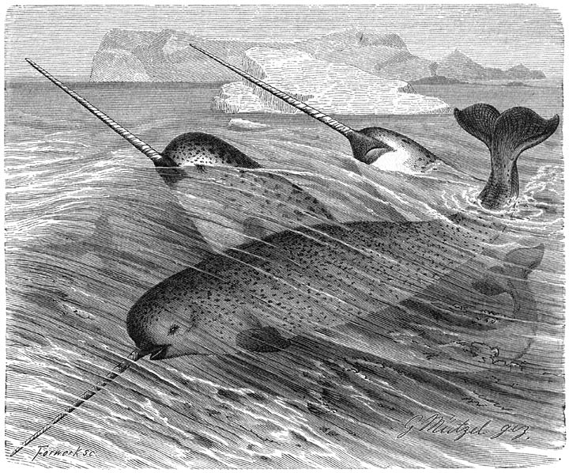
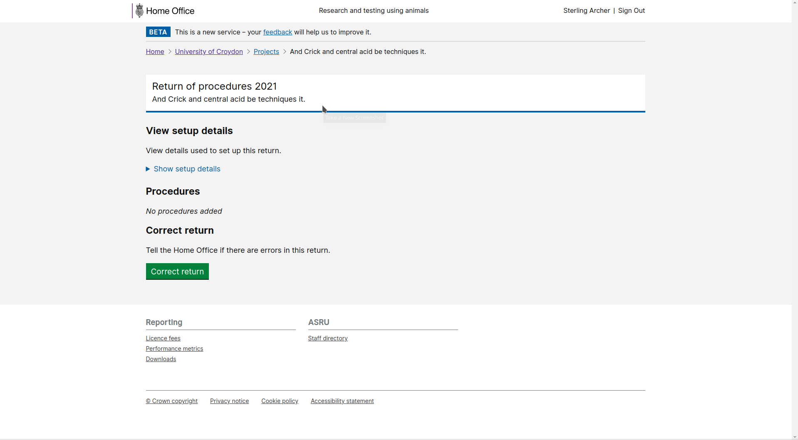

# Summary as of Wednesday 07 April 2021 

# Sprint 81

 

## Weekly Summary 
RoPs work is continuing, and we remain on course to delivery this for the summer. Behind the scenes, the RoP submission work is almost complete and is being validated, and the export of RoP data is progressing. The team has also focussed on the digitisation of PPL expiry warning notifications, which will soon be sent via email rather than by letter.

## Just Done
* Better email notification for revoked PPLs - working software
* Allow recall and resubmission of ROPs - working software

## About to Do/Doing
* Automation of PPL expiry emails - working software
* Download of ROPs data - working software
* Improvements to ROPs reporting and metrics - working software
* Allow discarding of incomplete RAs - working software

## Bugs Fixed this week
The following bugs were fixed this week.
[Bug Fixes week to Wednesday 07 April 2021](graphs/bugs07042021.png)

We planned the following issues in this sprint 
[Sprint 81](graphs/sprint07042021.png)

## Support tickets and known issues
[Link to Support Board](https://collaboration.homeoffice.gov.uk/jira/secure/RapidBoard.jspa?rapidView=1717&selectedIssue=ASSB-253)

[Support board - cached](graphs/supportBoard07042021.png)

## Click here for metrics / progress against plan
[Sprint 81](graphs/progress07042021.png)

[Post Release Roadmap](graphs/roadmap07042021.png)

[Roadmap Visualisaton (Experimental) ](roadmapVisualisation07042021.md)

## We set this goal for the current sprint 81 (Narwhal)
* ROPs end-to-end journey - released to production

## Screenshot from newly developed software
### Allow recall and resubmission of ROPs

 

## Google Analytics for this report
[Google Analytics](graphs/GA07042021.png)

