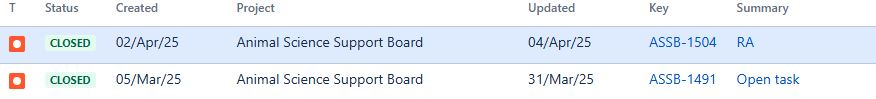

# Summary as of Wednesday 07th May 2025

## Future research and recruitment 

Thank you for your continued involvement in user research for ASPeL– your participation is integral to understanding the user experience. The research on ASPeL features continues. Please contact our user researcher David.utley@digital.homeoffice.gov.uk to participate. Thank you.  
 
# Sprint: 165(kodkod)

Attribution:

# Completed this Sprint
1) We have added some further updates to the Named Person roles nominations guides to help establishment in completing nominations for various roles. However, we have not yet made them available to users.
2) We have tidied up complications with ROP counts which were reflecting wrongly when a project licence is transferred between establishments. For example, notifications of falsely 'overdue' ROPs will no longer show in the original establishment's RoPs summary page. But the new establishment will be notified to submit a RoP if there is an overdue RoP. This is because RoPs move with Project licences.
3) We have implemented changes within ASPeL which enhance our capability for deploying completed work at a quicker pace.
4) The user researcher has played back to designers, team and ASRU the findings of the user research that was done on standard protocols improvements work. Thank you to all volunteers that helped with the process.
5) The standard protocols design prototype is now in review.
 

# Bugs Done or Closed this Sprint

 

# New Sprint 157 (Luna Moth)

Attribution:

# Planned for this Sprint 157(Luna Moth)
WE will;

1) 
   
   

   

## Things to bear in mind
Kindly let us know how we are doing in keeping you informed. We appreciate your feedback on the content of this report. 

# Work in progress
1) All outstanding change highlighting errors within ASPeL such as 'changed flag displayed when no change has been made', or flag not showing when comments have been added and all outstanding ROP related issues recently logged with us are continuing to be worked on as a high priority. We will update you as soon as resolved. 
