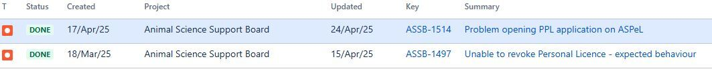

# Summary as of Wednesday 07th May 2025

## Future research and recruitment 

Thank you for your continued involvement in user research for ASPeL– your participation is integral to understanding the user experience. The research on ASPeL features continues. Please contact our user researcher David.utley@digital.homeoffice.gov.uk to participate. Thank you.  
 
# Sprint: 165(kodkod)

Attribution:

# Completed this Sprint
1) We have added some further updates to the Named roles nominations guides to support establishments nominating people for the roles. Users will not see these changes until all is done and tested.
2) We have tidied up complications with ROP counts which were displaying incorrectly as 'outstanding' when a project licence is transferred between establishments. Such notifications have been removed from the original establishment's RoPs summary page. But the new establishment will be notified to submit a RoP if there is an overdue RoP. This aligns with the fact that RoPs move with Project licences.
3) We have implemented changes within ASPeL which enhance our capability to deploy completed work at a quicker pace.
4) The user researcher has played back the findings of the user research that was done on standard protocols improvements work. Thank you to all participants in the research.
5) The design prototype for standard protocols is ready for review.
6) We added a 'revoke' button to enable PIL users who cannot otherwise revoke their Personal Licences when stuck between establishments. 

 

# Bugs Done or Closed this Sprint

 

# New Sprint 157 (Luna Moth)

Attribution:

# Planned for this Sprint 157(Luna Moth)
WE will;

1) Continue to improve the process of nominating people for named roles in establishments.
2) Complete the prioritised, outstanding RoPs requirements.
3) Complete the ongoing work required to improve the standards of the tickets we receive through the support board. 
4) Progress with standard GA breeding protocols: prepare for user research and confirm the content with animal care specialists.'
5) Continue work on the Change Highlighting tickets which have now been separated into two main epics for ease of understanding.
6) Explore options to upgrade the REACT version in ASPeL, because it is an important tool for its stability.
   
   

   

## Things to bear in mind
Kindly let us know how we are doing in keeping you informed. We appreciate your feedback on the content of this report. 

# Work in progress
1) All outstanding change highlighting errors within ASPeL such as 'changed flag displayed when no change has been made', or flag not showing when comments have been added and all outstanding ROP related issues recently logged with us are continuing to be worked on as a high priority. We will update you as soon as resolved. 
