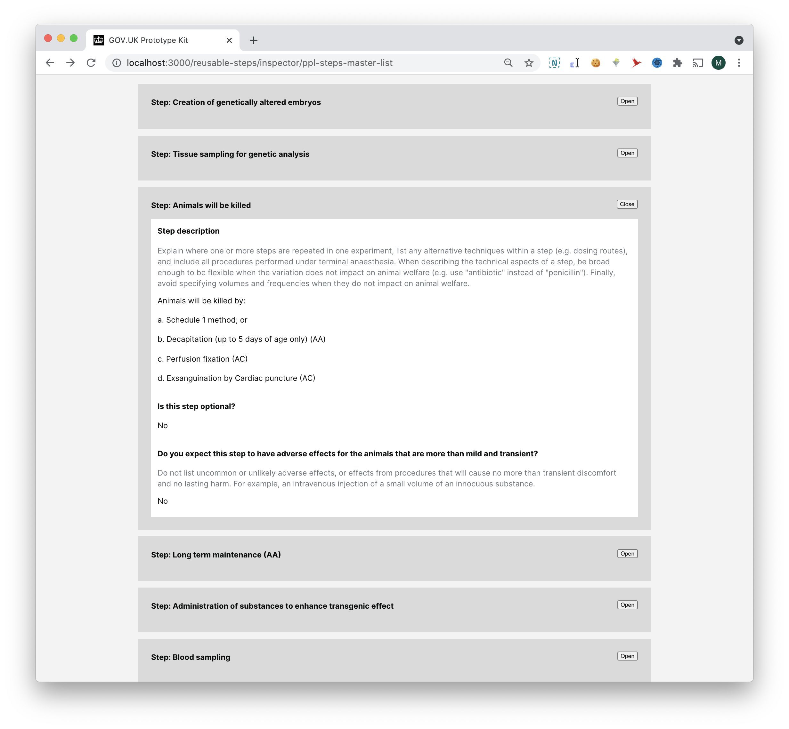

# Summary as of Wednesday 07 July 2021 

# Sprint 88

## Just Done
* Summarised findings from testing reusable steps with external users - user research 
* Reviewed previous research for PPL inspector review and assessment - user research
* GDPR housekeeping - user research
* Early design concepts for making reviewing steps on protocols faster for ASRU - design and content design

## About to Do/Doing
* Updating digital consent form to follow the latest HO template - user research 
* Reviewing outstanding PPL improvement requests from inspectors and applicants - user research 
* Content for email notifications to establishments for PIL E licences - content design
* Developing design concepts for ASRU review of reusable PPL protocol steps - design

## Bugs Fixed this week
The following bugs were fixed this week.
[Bug Fixes week to Wednesday 07 July 2021](graphs/bugs07072021.png)

We planned the following issues in this sprint 
[Sprint 88](graphs/sprint07072021.png)

## Support tickets and known issues
[Link to Support Board](https://collaboration.homeoffice.gov.uk/jira/secure/RapidBoard.jspa?rapidView=1717&selectedIssue=ASSB-253)

[Support board - cached](graphs/supportBoard07072021.png)

## Click here for metrics / progress against plan
[Sprint 88](graphs/progress07072021.png)

[Post Release Roadmap](graphs/roadmap07072021.png)

## These are our goals for the current sprint
1. Prepare for testing of reusable steps with inspectors (research and design) 
2. Resolution of ROPs issues raised by stats team - Ulysses butterfly

## These were our gols for the previous sprint 
1. Inspectors can grant licences - working software  ***[Done]***
2. Initial designs for reusable steps with inspectors - design ***[In progress]***
3. Complete testing of reusable steps with external users - user research ***[Done]***

## Sample Design Prototypes
### Design concepts for ASRU review of steps 

 

## Google Analytics for this report
[Google Analytics](graphs/GA07072021.png)

