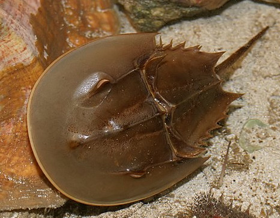

# Summary as of Wednesday 07 September 2022 

# Sprint 117 (Xiphosura)

## Just Done
* Saving state page on PPL applications to avoid confusing pop up messages for applicants - design and working software
* Include 'set deadline...' on conditions before the condition is added to the licence - working software 
* Several accessibility improvements around handing of pop-up boxes - working software

## About to Do/Doing
* Solving an issue around changing PEL holders - design
* Items stay in Taxi rank when marked as incomplete/incorrect - working software
* "Standard condition 13d is not applicable" - make available for all species - working software
* Reusable protocol steps in the PPL application - working software

## Bugs Fixed this week
The following bugs were fixed this week.
[Bug Fixes week to Wednesday 07 September 2022](graphs/bugs07092022.png)

We planned the following issues in this sprint 
[Sprint 117](graphs/sprint07092022.png)

## Support tickets and known issues
[Link to Support Board](https://collaboration.homeoffice.gov.uk/jira/secure/RapidBoard.jspa?rapidView=1717&selectedIssue=ASSB-253)

[Support board - cached](graphs/supportBoard07092022.png)

## Click here for metrics / progress against plan
[Sprint 117](graphs/progress07092022.png)

[Post Release Roadmap](graphs/roadmap07092022.png)

## These areas are the focus for this sprint
1. Design solution for page-saving
2. Start development on reusable steps

## Sample Design Prototypes

 

## Google Analytics for this report
[Google Analytics](graphs/GA07092022.png)

