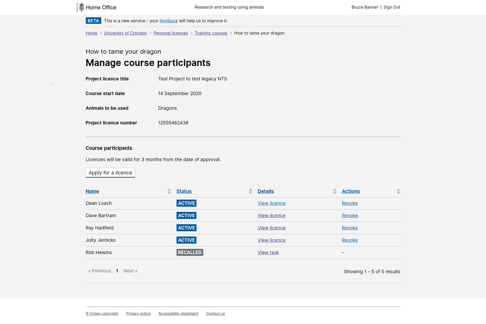

# Summary as of Wednesday 07 October 2020 

# Sprint 68 &#x1f951;

## Just Done
* Completed discovery research on returns of procedures with establishments and the stats team - user research
* Scheduled sessions with 6 inspectors for testing PPL assessment designs from 7th to 12th October - user research
* Prepared the discussion guide for the PPL assessment testing - user research
* Held a pilot study to test the session format - user research

## About to Do/Doing
* Holding research sessions with inspectors on assessing a PPL - user research
* PIL E reporting and licence fee management - working software 
* A raft of minor content and interaction amendments to improve general usability 

## Bugs Fixed this week
The following bugs were fixed this week.
[Bug Fixes week to Wednesday 07 October 2020](graphs/bugs07102020.png)

We planned the following issues in this sprint 
[Sprint 68](graphs/sprint07102020.png)

## Support tickets and known issues
[Link to Support Board](https://collaboration.homeoffice.gov.uk/jira/secure/RapidBoard.jspa?rapidView=1717&selectedIssue=ASSB-253)

[Support board - cached](graphs/supportBoard07102020.png)

## Click here for metrics / progress against plan
[Sprint 68](graphs/progress07102020.png)

[Post Release Roadmap](graphs/roadmap07102020.png)

### Our goal for this sprint is:
1. Test PPL assessments with inspectors - user research and design

## Sample Design Prototypes

 

## Google Analytics for this report
[Google Analytics](graphs/GA07102020.png)

