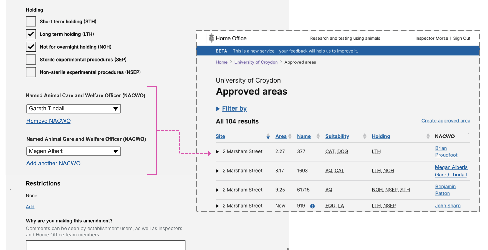

# Summary as of Wednesday 08 April 2020 

# Sprint 55

## Just Done
* Working software - add PPL collaborators (within an establishment) 
* Working software - PPL: Removed NMBA question from every step and improved 'fate of animals' questions
* Design - widen PPL reading panel
* Design - Adding multiple NACWOs to an area
* Design - allowing users to add NACWOs to areas without raising tasks for ASRU
* Content design NTS keywords
* Blog post for GDS

## About to Do/Doing
* Working software - NTS print view
* Working software - add training and education PPL questions
* Working software - new user permission level - block user
* Planning user research for category E PILs
* Content design - show tasks related to an entity
* Design - reduce scrolling on long PPL responses
* Design - Category E PILs

## Bugs Fixed this week
The following bugs were fixed this week.
[Bug Fixes week to Wednesday 08 April 2020](graphs/bugs08042020.png)

We planned the following issues in this sprint 
[Sprint 55](graphs/sprint08042020.png)

## Support tickets and known issues
[Link to Support Board](https://collaboration.homeoffice.gov.uk/jira/secure/RapidBoard.jspa?rapidView=1717&selectedIssue=ASSB-253)

[Support board - cached](graphs/supportBoard08042020.png)

## Click here for metrics / progress against plan
[Sprint 55](graphs/progress08042020.png)

[Post Release Roadmap](graphs/roadmap08042020.png)

Our goals for the current sprint are:
1. Add PPL Holder Training 
2. Category E PILs - Design 
3. ASRU Reporting
4. Plan Category E PIL research

## Sample Design Prototypes
### Adding multiple NACWOs to areas

 

## Screenshots of the PIL transfer journey
[PIL Transfer](TransferPIL.md)

## Google Analytics for this report
[Google Analytics](graphs/GA08042020.png)

