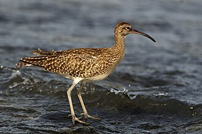

# Summary as of Wednesday 8th April 2026

## Future research and recruitment 

Thank you for your continued involvement in user research for ASPeL– your participation is integral to understanding the user experience. The research on ASPeL features continues. Please contact ASPELTechnicalQueries@homeoffice.gov.uk to participate. Thank you.  
 
# Completed Sprint 167(Vampire crab)

Attribution:

Interesting facts about vampire crab:
They possess bright yellow eyes and vibrant violet claws.

## Sprint Completion(A total of 17 issues were completed out of 31 brought into the Sprint. Work done included tasks, stories and bugs).

1) 10 additional tickets were completed to progress the named persons work, the completion is now at 90%.
2) 4 CAT E PILs tickets were completed, this brings the completion of the work on this feature to 50%
3) We updated the yearly licence fees for 26/27financial year on ASPeL
4) 1 tech debt ticket to improve the database was implemented
5) We completed pending accessibility compliance issues on ASPeL 

# Bugs done or closed this Sprint
[Bug Fixes 08042026](graphs/Bugs-080426.png)

# New Sprint 168(Whimbrel)

Attribution:

Interesting facts about whimbrels:They have a curved beak and a thrilling whistle.

# Our goals for Sprint 168(whimbrel)
Development:

1)complete standard protocol Proof of Concept for Standard Protocol 4
2)complete update to import and export authorisations
3)complete spike for NTS.docx bulk download 
4)conplete outstanding Named Person work 
5)complete all Category E PIL work on current board.

Design:

1)validate the standard protocols Proof of Concept with users 
2)complete design for NTS download screen 
3)provide support on completing named person work

   
  
  

## Things to bear in mind
Kindly let us know how we are doing in keeping you informed. We appreciate your feedback on the content of this report. Thank you.

