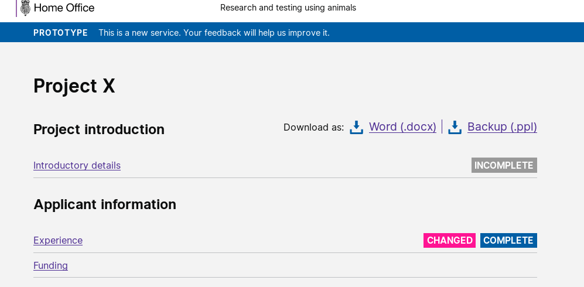

# Summary as of 8th May 2019 

# Sprint 32

## Just Done
* Introducing different licence types and related questions into the PPL application
* PPL application review deadline extension

## About to Do/Doing
* PPL drafts/versioning comparison
* PPL authorisations and conditions
* Print view of Protocols Cook Book of the NEW license
* Print view of the whole granted licence with real data NEW licence
* Organising user testing sessions with inspectors and external users for the next month
 

## Click here for Prioritised Road Map
[Prioritised Road Map](https://trello.com/b/p7x9hbPV/prioritised-roadmap)    [\(Cached Image\)](graphs/ASLRoadMap08052019.jpg)

## Click here for metrics / progress against plan
[Week 2 - Sprint 32 - Release 1](graphs/progress08052019.png)

## Burnup Chart

[Burnup Chart](burnup08052019.md)

## Risks
[Links to Project Risks in Trello](https://trello.com/b/VuFuCL7t/risk-register-and-kpis-asl-delivery) 
[Link to Risk Chart](graphs/risk08052019.png)

## Sprint Planning
* We planned the following issues in sprint planning [Link to Issues in Jira](https://jira.digital.homeoffice.gov.uk/secure/RapidBoard.jspa?rapidView=261)    [\(Cached Image\)](graphs/sprint08052019.png)

Our goals for the sprint are:
1. Conditions and Authorisations 
2. Design ready for PIL amendments 
3. UR and Design PEL holder authorisation of PPL 
4. Plan research - views of granted PPLs 
5. Plan ASRU conference and roadshow

## Screenshots of the PPL application prototype

 

 

## Google Analytics for this report

This shows:
* total number of users
* number of new users

[Google Analytics](graphs/GA08052019.jpg)

